# Installing podman on Mac
Installing podman on Mac is simple using a package manager. For this tutorial, we'll be using Homebrew.

First, verify if Homebrew is installed on your device by opening a terminal window and typing in and entering this command:
>Note: You can open a terminal window by pressing the `⌘CMD + SPACE` hotkey to open Spotlight Search, and searching for the "Terminal" application

```
brew --version
```

If Homebrew is installed, the command will print the version number of Homebrew that is installed. Otherwise, it will print an error message saying the command is not found.  
If it is not installed, refer to the installation tutorial below:

<details>
<summary>Installing Homebrew</summary>

1. First, visit the Homebrew [website](https://brew.sh).

2. On the homepage, there is a section that says "Install Homebrew" with a textbox below it. Click the clipboard button on the right to copy the script in the textbox:

<p align="center">
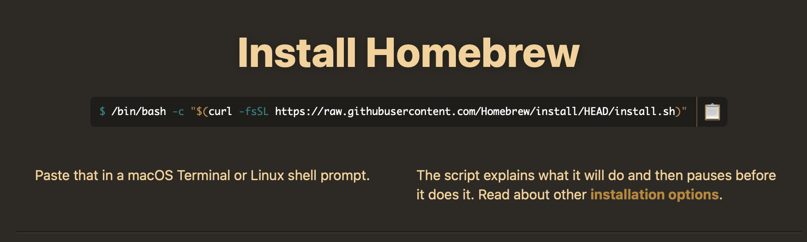
</p>

3. Open a terminal window and run the command.
4. This script installs Homebrew on your device, it will ask for your device's password. You will need to enter it to continue the installation.
5. Finally, verify that Homebrew is installed by running `brew --version`

</details>

Once Homebrew is installed, you can install podman by running `brew install podman` in the terminal. Finally, verify that podman is successfully installed by running `podman --version`.

## Installing podman-compose
To install podman-compose, we are using a different package manager, Conda. 

1. If Anaconda is already installed on your device, you can install podman-compose using this command:

```
conda install -c conda-forge podman-compose
```

If Anaconda is not installed, refer to the guide below:

<details>
<summary>Installing Anaconda</summary>

1. Visit the Anaconda [website](https://www.anaconda.com). 
2. On the home screen, there will be a download button with the Apple icon. Click that button to download the Anaconda installer.

<p align="center">

</p>

3. The website will show two installers, one for Intel chips and another for Apple Silicon chips. Be sure to download the version that matches your Mac's CPU. If you are unsure what chip you have, refer to the guide below:

<p align="center">
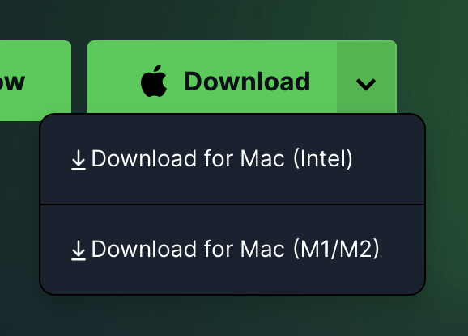
</p>

<details>
<summary>Figuring out what Chip you have</summary>

1. On the top left of your screen, there is an Apple logo in the menu bar. Click on that, and click `About This Mac` in the drop-down menu. 

<p align="center">
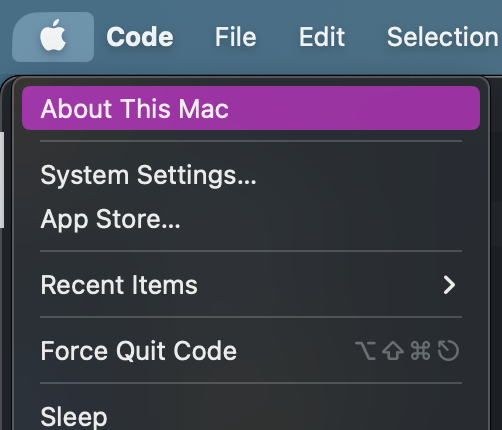
</p>

2. Clicking this will open a new window showing the details of your Mac. You can see what chip you have next to the "Chip" or "Processor" label:

<p align="center">
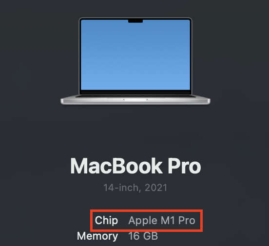
</p>

</details>

4. Once the installer is finished downloading, open the file. This screen will greet you:

<p align="center">
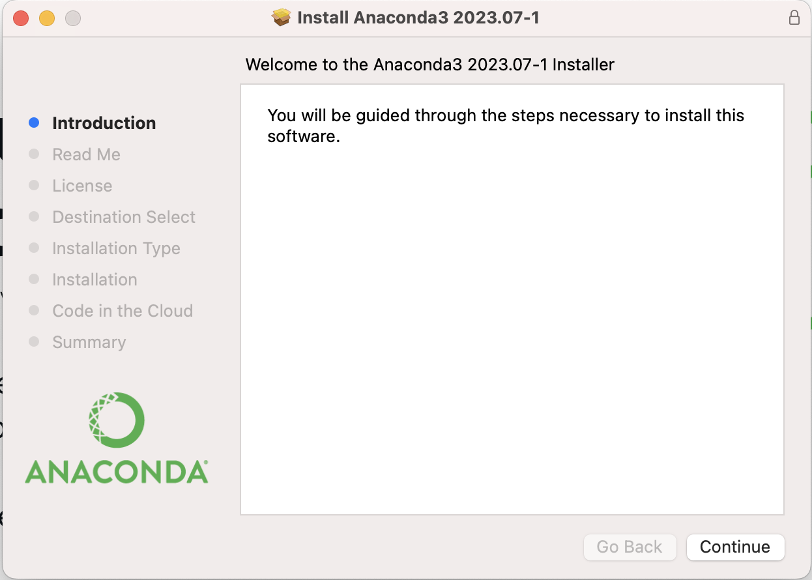
</p>

5. Once in the installer, click the continue button to move to the next screen until you reach the install screen. You do not need to change any settings for the Anaconda installation, so don't worry about missing any changes. Click the install button and wait for Anaconda to finish installing. When it is finished installing, you will see this screen:

<p align="center">
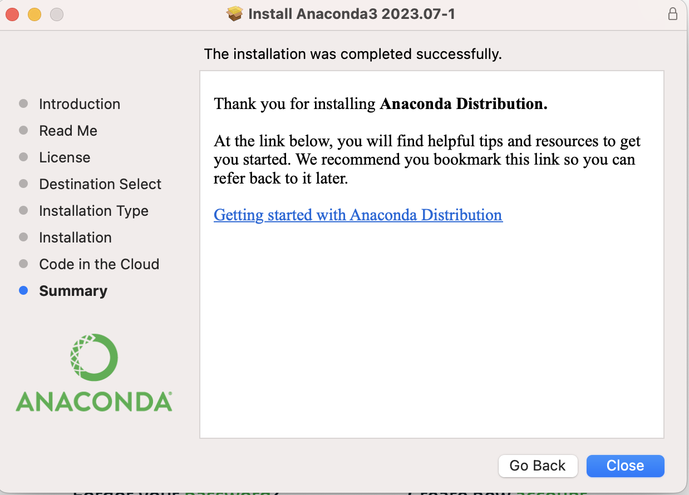
</p>

6. Now that Anaconda is installed, you will be prompted to delete the installer. It is no longer needed, so you can delete it to save storage.

<p align="center">
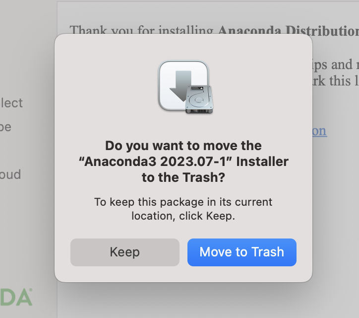
</p>

7. Run `anaconda --version` in the terminal to verify that Anaconda was successfully installed.

8. Now, run this command to install podman-compose:

```
conda install -c conda-forge podman-compose
```

</details>

Once podman-compose is installed, you can verify that it was successfully installed by running `podman-compose --version`

## Running Your First Container
1. Now that Podman is installed, we can create our first container.
2. On Windows devices and Macs, podman uses a virtual machine to create and run containers. You can initialize this machine by running:

```
podman machine init
podman machine start
``` 

This creates a podman machine with the default name `podman-machine-default`. Run `podman machine info` in the terminal to confirm that the machine was started.
Now that your machine is started, it can be started/stopped at anytime using `podman machine start` or `podman machine stop`

3. To create a Hello World container, open a terminal window and type in the command:

```
podman run --name hello-world-container hello-world
```

4. The `--name` flag sets the name of the created container to `hello-world-container`. `hello-world` is the name of the image that podman uses to create the container. Running the container gives this output:

<p align="center">

</p>

5. To save space/resources, remove the container using `podman rm hello-world-container`

## Creating a container using Dockerfiles stored in a GitHub Repository
1. First, clone the GitHub repository to your computer using the command `git clone REPOSITORY`. For this example, we'll be cloning the CSE [course-support repository](https://github.com/ucrcsedept/course-support.git).
>Note: Git is typically preinstalled on Macs, however, it is not preinstalled on Windows devices.. You can check if it is installed by running `git --version` in a terminal or command prompt window. If it is not installed, refer to the guide below.

<details>
<summary>Installing Git</summary>

<details>
<summary>Macs</summary>
If you don't have Git installed on your Mac, running `git --version` will prompt you to install/activate Git on most version of macOS. In this scenario, follow the instructions given to you in the terminal.

Otherwise, if you were not prompted to install Git, you can instead install Git using Homebrew. Run the command:

```
brew install git
```

</details>
<details>
<summary>Windows</summary>

1. Visit the Git windows installer download page [here](https://git-scm.com/download/win).
2. Download the standalone installer for the version of Windows you have (64-bit or 32-bit).
> Note: If you are unsure which version of Windows you have, press the hotkey `Windows Key + I` to open up your system settings. Select the `System` setting and scroll to the bottom of the left panel until u see an `About` section. Click on it. Under `Device Specifications`, there will be a `System Type` label that says whether you have a 64-bit or 32-bit device.

3. Open the installer.
4. You do not need to change any installation settings for Git, so you can click `Continue` in the bottom right of the installer until you are prompted to install Git.
5. Click install and wait for Git to finish installing. 
6. Once Git is finished installing, you can close out of the installer.

</details>

Finally, verify that Git was successfully installed using the `git --version` command.

</details>

2. Clone the course-support repository onto your device using the command:

```
git clone https://github.com/ucrcsedept/course-support.git
```

3. In the terminal, navigate to the cloned repository using the command: `cd DIRECTORYNAME`. For the course support repository, the directory name will be `course-support`.
4. Change directories to the `containers` directory using `cd` once again. For this tutorial, we'll be creating a container using the cs100 dockerfile, so now use the command `cd cs100` to change directories into the cs100 folder.
5. Now that we're in the `cs100` folder, we can use either `podman-compose` or `podman build` to build an image using the files inside the current directory.
	
	<details>
	<summary>podman-compose</summary>

	Run the command:

	```
	podman-compose up -d
	```

	This command will build AND run the container using the files in the current directory. the `-d` flag indicates that the container will run in detached mode. This means that the current terminal window will not attach to the container, instead, the container will run in the background.
	</details>
	<details>
	<summary>podman build</summary>

	Run the command:
	
	```
	podman build -t [name] .
	```
	
	The period at the end indicates that the build context is the current directory. This means that podman will create an image using the files in the directory it is currently in. You can run the new container using: 
	
	```
	podman run -d IMAGE
	```

	`IMAGE` is the name you set in the build command.
	>Note: You can add the `--name` flag to set a name for the container. Otherwise, the container will have a randomly generated name.
	</details>

5. You can verify the container is running using `podman ps`, which outputs a list of all currently running containers. If your container is on the list, you have successfully started your container. 
6. Now that your container is created, you can use the commands `podman start CONTAINERNAME` and `podman stop CONTAINERNAME` to start/stop your container whenever you need.

## Developing using VSCode in a container
Now that we've successfully created and started a container, we need to attach to it in order to develop inside of it. 
1. Head to the extension tab and install the "Dev Containers" extension in VSCode.
2. Click on the gear icon on the Dev Containers store page and click on "Extension Settings" to go to the settings for Dev Containers.
3. Once in the settings, scroll down to the `Dev > Containers: Docker Path` section and replace `docker` with `podman`:

<p align="center">

</p>

Additionally, in the `Dev > Containers: Docker Compose Path` setting, replace `docker-compose` with `podman-compose`:

<p align="center">
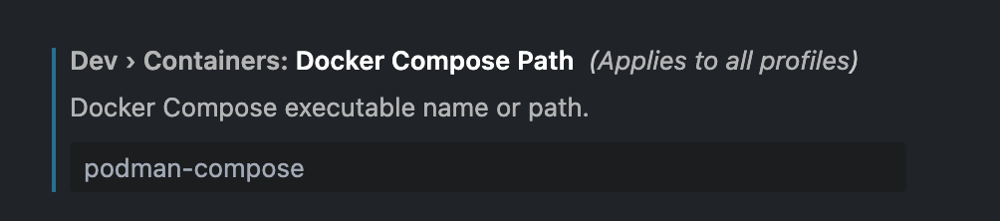
</p>

**Dev Containers will not work with Podman if these settings are not adjusted, so ensure that they are correctly changed.**

4. To attach to a running container, click on the button to the bottom right and click `Attach to Running Container...` and select to container you want to attach to:

<p align="center">
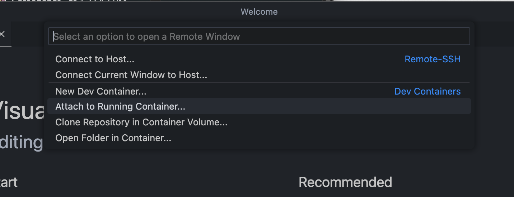
</p>

<p align="center">
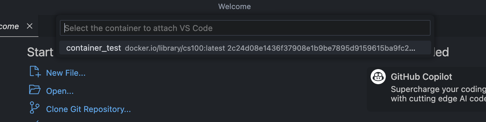
</p>

Alternatively, You can also use the *Remote Explorer* tab on the left sidebar, and under the `Dev Containers` section, find the container you want to connect to, right click and select `Attach in Current Window` or `Attach in New Window`:

<p align="center">
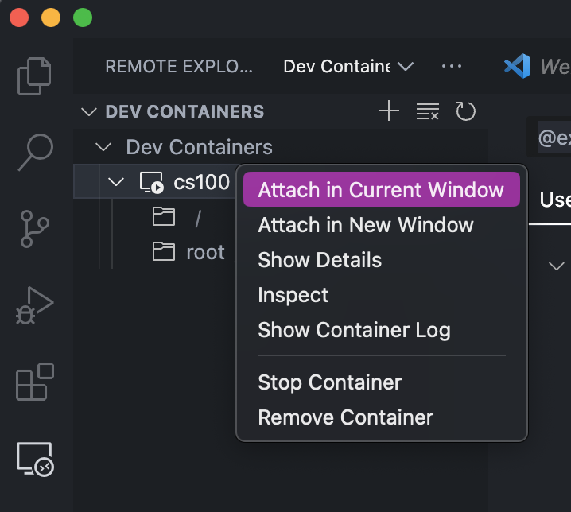
</p>

>Note: If the Remote Explorer tab isn't showing "Dev Containers", you may be in the "Remotes (Tunnels/SSH)" tab instead. Switch over by clicking the drop-down menu at the top to the right of "REMOTE EXPLORER" at the top of the sidebar and select "Dev Containers" 

<p align="center">
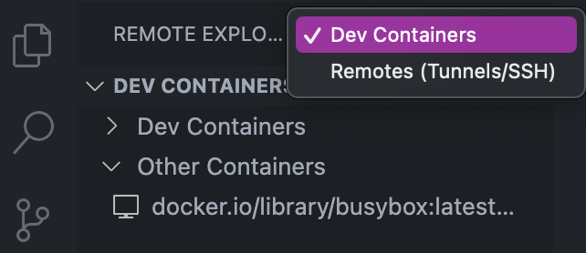
</p>

5. This connects VSCode to your container, allowing you to work inside it.
6. To verify that the connection was successful, open a new terminal in VSCode by clicking the `Terminal` button in the top menu bar and clicking `New Terminal`. The user will look similar to `root@24aef0be3792:~#`. The characters after `root@` will be the ID of the container. VSCode will also say that you are connected to remote in the sidebar. 

You have now successfully created and entered a container for your course in VSCode!

## Creating Your First C++ Program in a Container
1. Upon opening the container for the first time, VSCode will show a home page with no folder opened:

<p align="center">

</p>

2. Click the "Open" button in the middle of the welcome screen with a folder next to it. 
3. Clicking that will open a window to select a folder to open. The window will display the `/root/` directory. First, click the two dots `..` to move up to the parent directory. Then, locate the `home` file and open it. 

<p align="center">
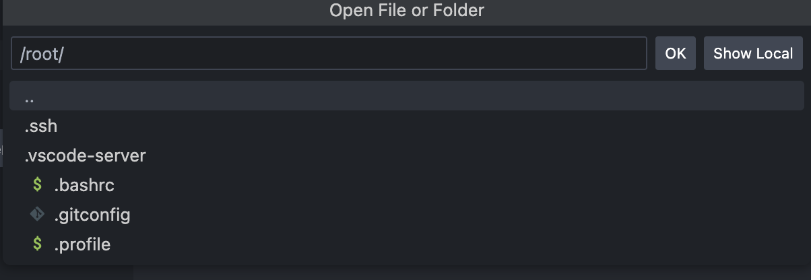
</p>

<p align="center">
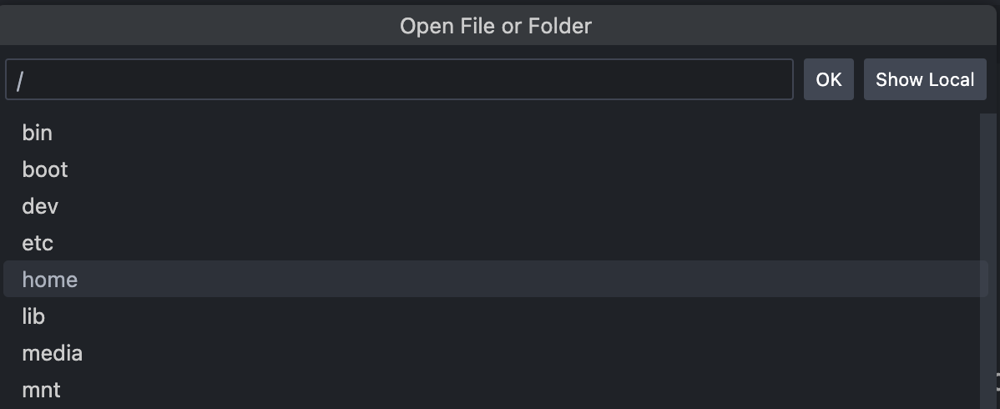
</p>

4. Once you open the Home directory, the sidebar will display that you are in the home directory, which is currently empty.

<p align="center">
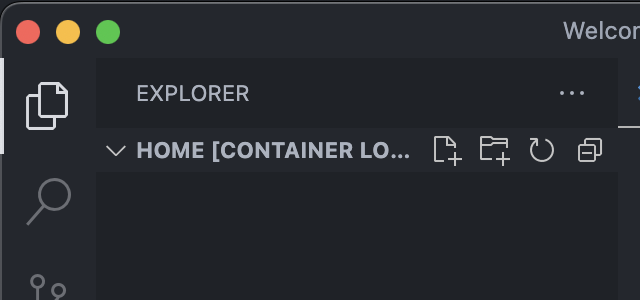
</p>

5. Click the leftmost button on the file editor bar to create a new file and name it `main.cpp`. 

<p align="center">
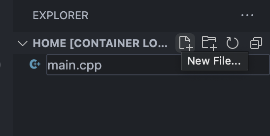
</p>

6. View the file, and copy and paste this code snippet into the file. 

```
#include <iostream>

using namespace std;

int main() {

    cout << "Hello world!" << endl;

    return 0;
}
```

7. Click the Terminal dropdown button in the menu bar and create a new terminal window. This will create a new terminal screen at the bottom of the VSCode window. On Windows, the Menu may be a hamburger icon (☰) instead.

<p align="center">

</p>

8. In this terminal, enter the command `g++ main.cpp`. This command will compile your Hello World program and create a new file in the same directory named `a.out`.

9. In the terminal window again, type the command `./a.out`. This will run the program you just made, the only output should be `Hello World!`.

10. If you see that output in the terminal, you have successfully created a Hello World program within your container. Once completed, this is what your terminal should look like:

<p align="center">
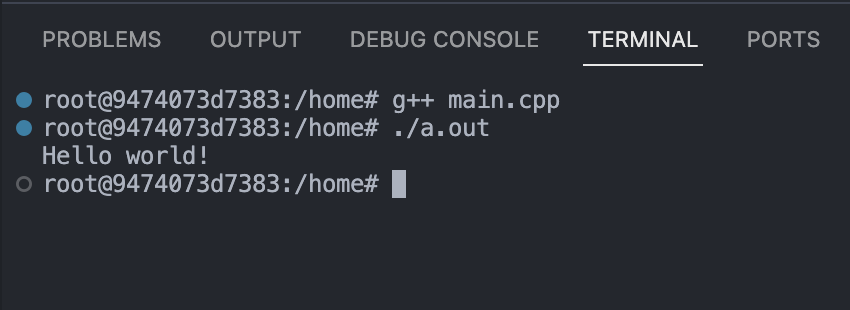
</p>

## Coding Using Git in a Container
>Note: This section requires having git installed on your device. If you didn't install it before, follow the instructions for installing git under [Creating a container using Dockerfiles stored in a GitHub Repository](#creating-a-container-using-dockerfiles-stored-in-a-github-repository)
1. In order to code using Git, you will first need a GitHub account. If you don't have a GitHub account already, visit the GitHub [website](https://github.com/) and create an account. 
2. Now that you have a GitHub account, you need to create a repository. Click on your profile icon in the top-right of the screen, and click on "Your Repositories"

<p align="center">
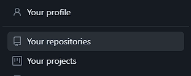
</p>

3. On this next screen, click the green "New" button to create a new repository. You can give it any name and you do not need to change any settings.
4. To clone your GitHub repository into your container, first copy the URL of your GitHub repository.
5. Then, open a new terminal in VSCode and enter the command:

```
git clone REPOSITORYURL
```

6. This creates a copy of the repository in your container. The folder will have the same name as your repository. Open this new folder in VSCode.
7. Now that you are in your repository, you are free to create any program you like. You can use the same [Hello World C++ program](#creating-your-first-c-program-in-a-container) you created before if you'd like.
8. With a program created, now you need to push those changes to your repository on GitHub.
9. First, you need to config your GitHub username and email. In a terminal, enter the commands:

```
git config user.name YOURUSERNAME
git config user.email YOUREMAIL
```

Using the username and email used for your GitHub account.
10. To stage your changes, use the command `git add --a`. This stages every change you've made to be added to your GitHub repository.
11. To commit these changes, use the command `git commit -m COMMITMESSAGE`. 
12. Finally, to push your local changes to the GitHub repository using `git push`. 
13. Now, head back to your repository on GitHub. You should see the files you created in the container added to the repository.

<p align="center">
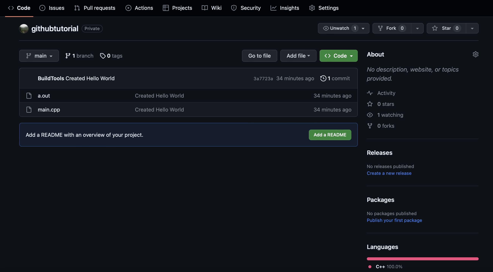
</p>