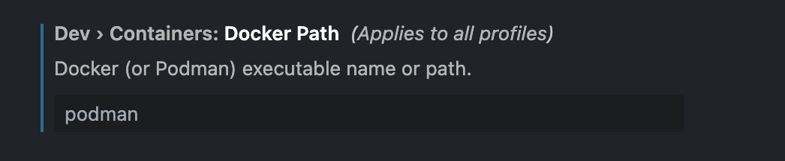
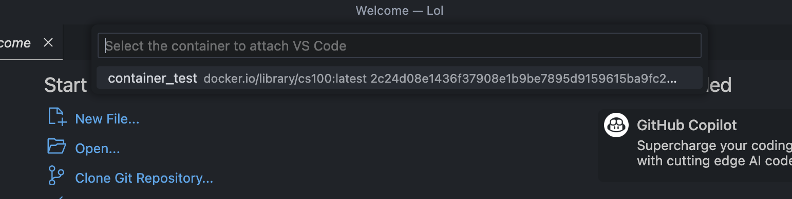

## Installing podman on Mac
Installing podman on Mac is simple using a package manager. For this tutorial, we'll be using Homebrew.

First, verify if Homebrew is installed on your device by opening a terminal window and running this command:
```
brew --version
```

If Homebrew is installed, the command will print the version number of Homebrew that is installed. Otherwise, it will print an error message saying that the command is not found.  
If it is not installed, refer to the installation tutorial below. 

<details>
<summary>Installing Homebrew</summary>

1. First, visit the Homebrew [website](https://brew.sh).
2. On the homepage, there is a section that says "Install Homebrew" with a textbox below it. Click the clipboard button on the right to copy the script in the textbox.
3. Open a terminal window and run the command.
4. This script installs Homebrew on your device, it will ask for your device's password and you will need to enter it to continue installation.
5. Finally, verify that Homebrew is installed by running `brew --version`.

</details> <br />

Once Homebrew is installed, you can install podman by running `brew install podman` in the terminal.

## Installing podman-compose
#### Using Python/Conda
1. If Anaconda Python is installed on your device, you can install podman-compose using this command:
```
conda install -c conda-forge podman-compose
```
>If python is installed some other way, replace `conda` with either `pip` or `pip3` and run the same command.

#### Using Homebrew
1. podman-compose can be instaleld using Homebrew with the command: 
```
brew install podman-compose
```

Once podman-compose is installed, you can verify that it was successful by running `podman-compose --version`

## Running Your First Container
1. Now that Podman is installed, we can create our first container.
2. On Macs, podman uses a virtual machine to create and run containers. You can initialize this machine by running:
```
podman machine init
podman machine start
``` 
This creates a podman machine with the default name `podman-machine-default`. Run `podman machine info` in the terminal to confirm that the machine was started

3. To create a Hello World container, open a terminal window, and type in the command:
```
podman run --name hello-world-container hello-world
```
4. The `--name` flag sets the name of the created container to `hello-world-container`. `hello-world` is the name of the image the container that podman uses to create the container. Running the container gives this output:

<p align="center">

</p>

5. To save space/resources, remove the container using `podman rm hello-world-container`

## Creating a container using Dockerfiles stored in a Github Repository
1. First clone the GitHub repository to your computer using `git clone`. For this example, we'll be cloning the CSE [course-support repository](https://github.com/ucrcsedept/course-support.git).
2. In the terminal, navigate to the repository using `cd`. 
3. Navigate to the course directory you want to create a container for inside the `containers` folder. For this example, we'll use `cs100`.
4. Now that we're in the `cs100` folder (or whichever class you chose) we can use either `podman build` or `podman-compose` to build an image using the files located inside the current directory.
	<details>
	<summary>podman build</summary>
	Run the command:
	
	```
	podman build -t [name] .
	```
	
	The period at the end indicates that the build context is the current directory. This means that podman will create an image using the files in the directory it is currently in. You can now run the new container using: 
	
	```
	podman run [options] IMAGE
	```

	`IMAGE` is the name you set in the build command.
	>The `--name` flag allows us to set a name for the container. Otherwise, the container will have a randomly generated name.
	</details>

	<details>
	<summary>podman-compose</summary>
	Run the command:

	```
	podman-compose up -d
	```

	This command will build AND run the container using the files in the current directory. the `-d` flag indicates that the container will run in detached mode. This means that the current terminal window will not attach to the container, and instead the container will run in the background.
	</details>

5. You can verify the container is running using `podman ps`, which outputs a list of all currently running containers.

## Developing using VSCode in a container
1. Head to the extension tab and install the  "Dev Containers" extension in VSCode
2. Click on the gear icon on the Dev Containers store page and click on "Extension Settings" to go to the settings for Dev Containers
3. Once in the settings, scroll down to the `Dev > Containers: Docker Path` section and replace `docker` with `podman`:

<p align="center">

</p>

Additionally, in the `Dev > Containers: Docker Compose Path` setting, replace `docker-compose` with `podman-compose`:

<p align="center">

</p>

4. To attach to a running container, click on the button to the bottom right and click `Attach to Running Container...` and select to container you want to attach to:

<p align="center">
 

</p>

Alternatively, You can also use the *Remote Explorer* tab on the left sidebar, and under the `Dev Containers` section, find the container you want to connect to, right click and select `Attach in Current Window` or `Attach in New Window`:

<p align="center">

</p>

>If the Remote Explorer tab isn't showing "Dev Containers", you may be in the "Remotes (Tunnels/SSH)" tab instead. Switch over by clicking the drop-down selection at the top to the right of "REMOTE EXPLORER" at the top of the sidebar and select "Dev Containers" 

<p align="center">

</p>

5. A new VSCode window will open, which will be connected to the selected container.
6. To verify that the connection was successful, open a terminal and the user will look similar to `root@24aef0be3792:~#`. The characters after `root@` will be the ID of the container.
