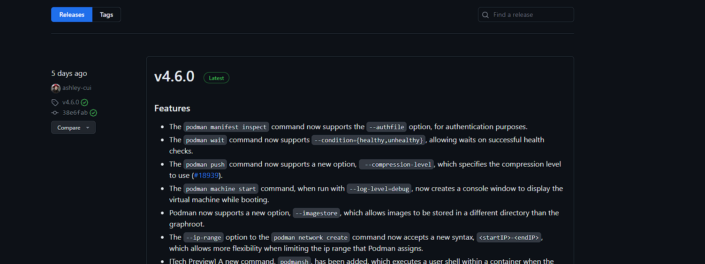
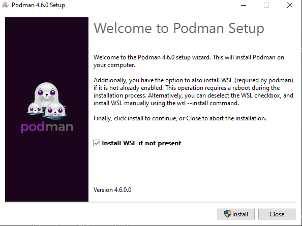

# Installing Podman on Windows
1. First, visit the Podman releases page on Podman's [GitHub](https://github.com/containers/podman/releases).
2. Find the most recent stable release of Podman (indicated by the green "Latest" tag next to the version number) and scroll down to the "Assets" section.

3. Under the Assets tab, download the setup.exe file and run the file.

4. Once inside the Podman installer, there is a checkbox to install the Windows Subsystem for Linux (WSL). Installing this is necessary to use Podman, so ensure the box is checked.

5. Click the install button to begin the installation process and wait for the installer to finish.

>Note: If you are installing WSL, your computer may restart during the installation process

6. To verify that podman was successfully installed, open a command prompt window and enter `podman --version`

[//]: # (Podman usage is essentially the same as in Mac, so the instructions for that are in the Mac readme file)
