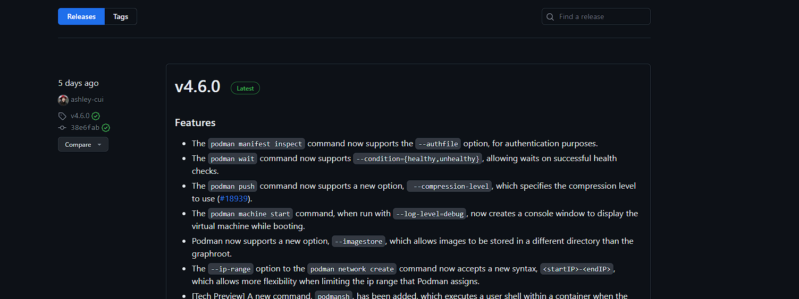
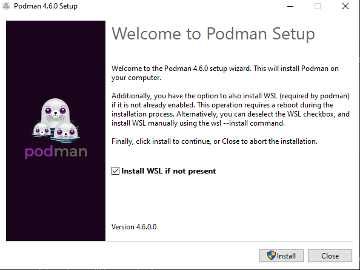
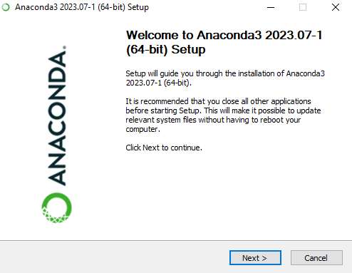
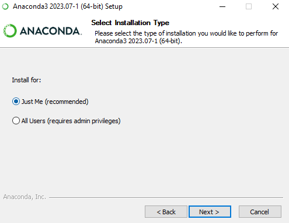
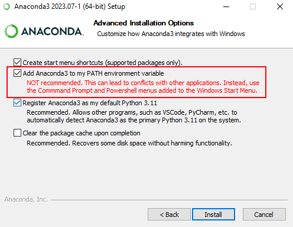
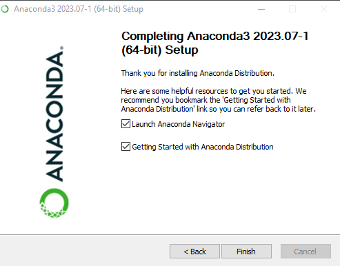

# Installing Podman on Windows
1. First, visit the Podman releases page on Podman's [GitHub](https://github.com/containers/podman/releases).
2. Find the most recent stable release of Podman (indicated by the green "Latest" tag next to the version number) and scroll down to the "Assets" section.

<p align="center">

</p>

3. Under the Assets tab, download the setup.exe file and run the file.

<p align="center">

</p>

4. Once inside the Podman installer, there is a checkbox to install the Windows Subsystem for Linux (WSL). Installing this is necessary to use Podman, so ensure the box is checked.

<p align="center">

</p>

5. Click the install button to begin the installation process and wait for the installer to finish.

>Note: If you are installing WSL, your computer may restart during the installation process

6. To verify that podman was successfully installed, open a command prompt window and enter `podman --version`
>Note: You can open up a command prompt window by pressing `Windows Key + R`. This will open up a window in the corner of your screen. In this window, type in `cmd` and press enter to run a new command prompt window. It will look like a black box. 

## Installing podman-compose 
Installing podman-compose on Windows requires a package manager. For this tutorial, we'll be using Conda

#### Installing Anaconda
1. Visit the Anaconda [website](https://www.anaconda.com/). 
2. On the home screen, there will be a download button with the windows icon. Click that button to download the Anaconda installer.

<p align="center">

</p>

3. Once the installer is finished downloading, open the file. You will be greeted by this screen:

<p align="center">

</p>

4. Click the next button until you reach a screen that asks you to select installation type that looks like this:

<p align="center">

</p>

5. Don't change any settings on this page, as it is unnecessary to install Anaconda for other users.

6. Click next to the Advanced Installation Options. On this screen, click the checkbox next to the `Add Anaconda3 to my PATH environment variable` option, highlighted in the image below. 
>Note: While The installer does recommend using this settings, using that settings is necessary for us to use Anaconda outside of the Anaconda Prompt

<p align="center">

</p>

7. Click the install button and wait for Anaconda to finish installing. It will show this screen once installation is finished:

<p align="center">

</p>

Opening the Anaconda Navigator or the Getting Started guide is not necessary, so you can exit the installer now.

8. Verify that Anaconda was successfully installed by opening a new command prompt window and running `conda --version`

#### Installing podman-compose
Now that you have Anaconda on your device, installing podman-compose is very simple.
1. First, open up a new command prompt window.
3. Once in the window, copy this command in and press enter:

```
conda install -c conda-forge podman-compose
```

This command installs podman-compose on your device.
>Note: During the installation process, conda may ask if you want to update, downgrade, or supersede certain packages. Enter `Y` for all of these.

4. Once the installation process is finished, enter the command `podman-compose --version` to verify that it was successfully installed.

[//]: # (Podman usage is essentially the same as in Mac, so the instructions for that are in the Mac readme file)
