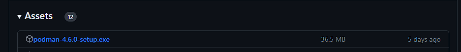
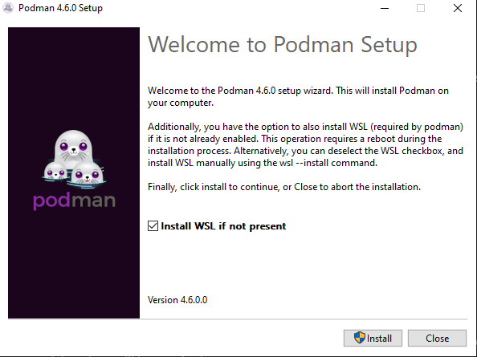

# Installing Podman on Windows
Installing 
1. First, visit the Podman releases page on Podman's [GitHub](https://github.com/containers/podman/releases).
2. Under the most recent stable release of Podman (indicated by the green "Latest" tag next to its name), scroll down to the "Assets" section

<p align="center">

</p>

3. Under the Assets tab, download the setup.exe file and run it.

<p align="center">

</p>

4. The Podman installer has a checkbox to install the Windows Subsystem for Linux (WSL). Installing this is necessary to use Podman, so ensure the box is checked.

<p align="center">

</p>

5. Click the install button to begin the installation process. 

>Note: If you are installing WSL, your computer may restart during the installation process

## Running Your First Container
1. Now that Podman is installed, we can create our first container.
2. On Windows devices, podman uses a virtual machine to create and run containers. You can initialize this machine by running:

```
podman machine init
podman machine start
``` 

This creates a podman machine with the default name `podman-machine-default`. Run `podman machine info` in the terminal to confirm that the machine was started

3. To create a Hello World container, open a terminal window, and type in the command:

```
podman run --name hello-world-container hello-world
```

4. The `--name` flag sets the name of the created container to `hello-world-container`. `hello-world` is the name of the image the container that podman uses to create the container. Running the container gives this output:

<p align="center">

</p>

5. To save space/resources, remove the container using `podman rm hello-world-container`

Error loading webview: Error: Could not register service workers: InvalidStateError: Failed to register a ServiceWorker: The document is in an invalid state..