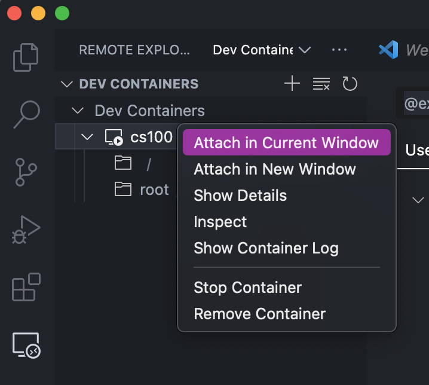
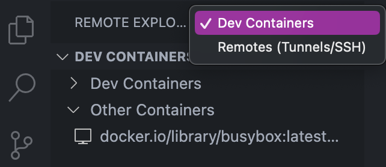

## Installing podman
1. Visit podman [website](https://podman.io) 
2. Download podman desktop version. The download button is on the home page of the website
3. Open the .dmg file and you will see a window like this. 
4. Drag the Podman desktop icon to the application folder
5. Close the .dmg file and open up the Podman desktop application
6. It will say "'Podman Desktop' is an app downloaded from the internet. Are you sure you want to open it?" with the options "Cancel" or "Open". Click on open
7. Upon opening Podman Desktop, you are greeted with a welcome screen. Click on "Go To Podman Desktop" to proceed to the home screen
8. Now that Podman's desktop application is installed, we need to install podman
9. Podman desktop's home screen will say that podman isn't detected, and gives a button to install the latest stable version of podman (4.5.1 in this case) 
10. Click the install button and click "Yes" on the prompt to install Podman and wait for Podman Desktop to finish installing podman 

## Installing podman-compose
#### Using Python
1. If Anaconda Python is installed on your device, simply run `conda install -c conda-forge podman-compose` to install podman-compose
	1. If python is installed some other way, replace `conda` with either `pip` or `pip3` and run the same command.
2. If Python is not installed, refer to the Homebrew installation section.

#### Using Homebrew
1. Verify if Homebrew is installed on your device by running `brew` in the terminal. The terminal will output `zsh: command not found: brew` if Homebrew is not installed
	1. If Homebrew is installed, simply run `brew install podman-compose` and you are finished
2. If it's not installed, you will need to install it by first visiting the Homebrew [website](https://brew.sh).
3. On the homepage, there will be a section that says "Install Homebrew" with a textbox below it. Click the clipboard button on the right to copy the script in the textbox and run it in your terminal.
4. This script installs Homebrew on your device, it will ask for your device's password and you will need to enter it to continue installation.
5. Now that Homebrew is installed, run `brew install podman-compose` to install podman-compose.

## Running a Hello World Container
1. Now that Podman is installed, we can create our first container.
2. Podman requires a virtual machine to create and run containers. You can initialize this machine by running `podman machine init` in the terminal and then `podman machine start` in the terminal. Then, enter `podman machine info` in the terminal to confirm that the machine was started
3. To create a Hello World container, open a terminal window, and type in the command `podman run --name hello-world-container hello-world`
4. The `--name` flag sets the name of the container to `hello-world-container`.  This container will output: 
5. To save space/resources, remove the container using `podman rm hello-world-container` 

## Using Podman
1. Container images can be searched using the `podman search [options] TERM` command in the terminal. Ex. `podman search busybox` 
	1. This command searches for images in registries. It can be used to search all default registries or specific registries
2. Building an image from a containerfile is done using the `podman build [options] CONTEXT` command. The context is the specified directory where the files used to build the image are stored. It can be specified as a URL, git repository, or containerfile. Use the `-t NAME` option to assign a name to the resulting image
3. Running an image is done using the `podman run [options] IMAGE` terminal command. Doing this command creates the container, which can now be seen in podman desktop. A preexisting container can be started using the `podman start [options] CONTAINER` command.
	- Podman desktop allows for easy management of containers. One can view logs, run commands in the container's terminal, start and stop containers, etc. 
	- Once a container is started in podman desktop, you can connect to it in the terminal using `podman attach [options] CONTAINER` 

## Creating a container using Dockerfiles Stored in a Github Repository
1. First clone the GitHub repository to your computer using `git clone`. In this example, we'll be cloning the CSE [course-support repository](https://github.com/ucrcsedept/course-support.git) 
2. In the terminal, navigate to the repository using `cd`. 
3. Navigate to the course you want to create a container for located in the `docker` folder. For this example, we'll use `cs100`.
4. Now that we're in the `cs100` folder (or whichever class you chose) we can use either `podman build` or `podman-compose` to build an image using the files located inside the current directory.
	1. Using `podman build`, run the command `podman build -t [name] .` The period at the end indicates that the context is the current directory. This means that podman will create an image using the files in the directory it is currently in. You can now run the new container using `podman run [options] IMAGE`, where `IMAGE` is the name you set in the build command.
		1. Adding the `--name` flag allows the container to have a custom name. Otherwise, the container will have a randomly generated name.
	2. Using `podman-compose`, run the command `podman-compose up -d`. This command will build AND run the container using the files in the current directory. the `-d` flag indicates that the container will run in detached mode. This means that the current terminal window will not attach to the container, and instead the container will run in the background. 
5. The container should now be running, and will show up in Podman Desktop in the containers tab 
6. You can verify the container is running using `podman ps`, which outputs a list of all currently running containers.

## Developing using VSCode in a container
1. Head to the extension tab and install the  "Dev Containers" extension in VSCode
2. Click on the gear icon on the Dev Containers store page and click on "Extension Settings" to go to the settings for Dev Containers
3. Once in the settings, scroll down to the `Dev > Containers: Docker Path` section and replace `docker` with `podman`  Additionally, in the `Dev > Containers: Docker Compose Path` setting, replace `docker-compose` with `podman-compose` 
4. To attach to a running container, click on the button to the bottom right and click `Attach to Running Container...` and select to container you want to attach to.    Alternatively, You can also use the *Remote Explorer* tab on the left sidebar, and under the `Dev Containers` section, find the container you want to connect to, right click and select `Attach in Current Window` or `Attach in New Window` 
	1. If the Remote Explorer tab isn't showing "Dev Containers", you may be in the "Remotes (Tunnels/SSH)" tab instead. Switch over by clicking the drop-down selection to the right of "REMOTE EXPLORER" at the top of the sidebar and select "Dev Containers" 
5. A new VSCode window will open, which will be connected to the selected container.
6. To verify that the connection was successful, open a terminal and the user will look similar to `root@24aef0be3792:~#`. The characters after `root@` will be the ID of the container.
