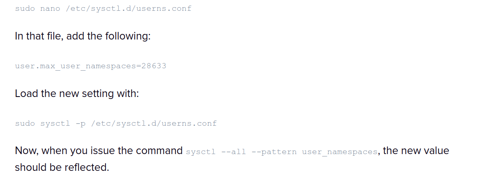

# Podman Installation -- Ubuntu & Arch

This tutorial will walk you through the steps to install Podman and Podmam-Compose.  You will use Podman and Podman-Compose for container management.

If you fall into any of the following categories, we recommend working with Podman:

1. If you are simply curious about Podman and wish to explore it beyond the classroom setting.
2. If you prefer working on a local machine instead of a remote one.
3. If the remote method is not working as expected for you.
4. If your course instructor has directed you to use Podman.

We advise you to utilize the pre-configured containers available on the UCR servers. This will lead to a smoother and more optimized experience for your specific needs.

This tutorial requires having a terminal open. To open a new terminal window, press the Windows Key, and type in "Terminal".

This tutorial will also use some terminology that might be new.  They are defined here in case you are not familiar with them or have not used them in a while: 
  - `sudo` allows you to run a command as the superuser (root)
  - `pacman` is Arch Linux's native package manager and it has to be run with sudo
  - `yay` is one of Arch Linux's pacman wrappers that allows you to download from the AUR

## Ubuntu
### Installation
In a terminal window type the command, **`sudo apt-get update && sudo apt-get install podman podman-compose git`**
* This command will synchronize your system with the latest package information from the repositories defined in your system. There are by default repositories installed so you do not need to worry. After synchronization, it will then install `podman` `podman-compose` and `git`

## Common Issues
* If there is an error when it comes to starting a container that does not make sense, there is a chance your disk space is low. 


## Arch

### Installation

In a terminal window type the command, **`sudo pacman -Sy`**
  - This command is running `pacman`, which is Arch's native package manager, as a superuser (root), the `-S` flag meaning synchronize, and the `y` meaning refresh, meaning you're refreshing and synchronizing all the packages from the main repository to your local device 
  - NOTE: You may want to restart your system because there's a possibility there was a kernel update.

To install podman, podman-compose, and git, type **`sudo pacman -S podman podman-compose git`**
  * This command is using `pacman` to install the packages `podman` `podman-compose` and `git`

Now, type **`podman system reset`**
- This command will completely reset `podman` and removes all pods, containers, images, networks, volumes, and machines
   
### Issues

- Root or **`sudo`** is the only way to run Podman / Docker, leading to not see containers on VS Code as permission was denied.
    - How does one fix this?
        - According to [this](https://www.techrepublic.com/article/enable-podman-sudoless-container-management/) article, “Part of the reason for this is kernel namespaces and unique IDs and group IDs. Under normal circumstances, a user has access to around a thousand UIDs that will be assigned to various processes within a namespace. However, Podman uses a subordinate operating system that is assigned to the user who deployed the container. Because of that, your user needs considerably more UIDs and SUBUIDs than the default. So, not only do we have to increase the number of SUBUIDs and SUBGIDs, but we also have to allow those UIDs and GIDs within the user’s namespace and install a piece of software that will provide user-mode networking for unprivileged network namespaces.”
        
        ```bash
        sudo usermod --add-subuids 200000-265536 --add-subgids 200000-265536 $USER
        ```
        
        - After that, you need to check if the user has access to enough namespaces:
        
        ```bash
        sysctl --all --pattern user_namespaces
        ```
        
        - If this number is around 1000, follow these steps:
        
        
        
        - To install the user-mode networking software, run **`sudo pacman -S slirp4netns`** which installs `slirp4netns` and lets the user perform unprivileged network namespaces
        - Once that is done, reboot your system and you should be ready to use podman!
- On starting the container, if you get an issue like
    - fix: WARN[0000] aardvark-dns binary not found, container dns will not be enabled
        - In order to fix this, simply run **`sudo pacman -S aardvark-dns`** which installs `aarvark-dns` and runs an authoritative dns server for A/AAAA container records.


