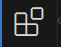
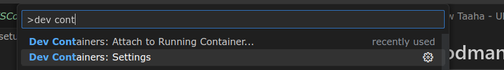
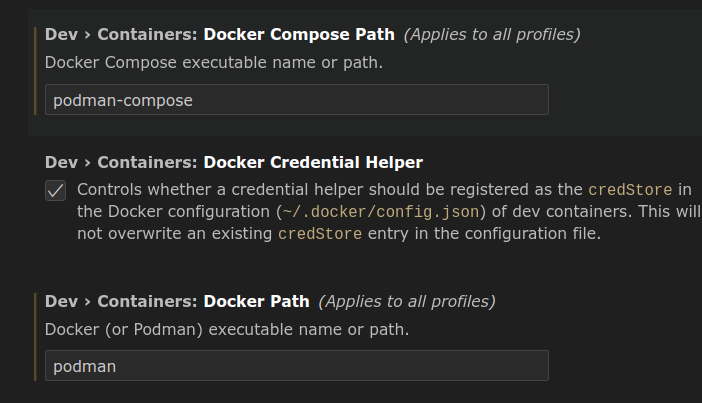
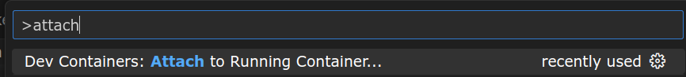
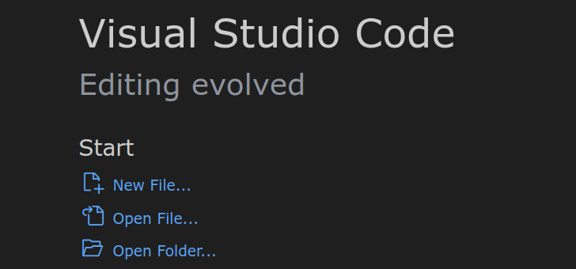
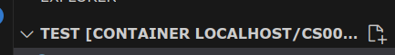

# Podman Installation -- Ubuntu & Arch

This tutorial will walk you through the steps to install Podman and Podmam-Compose.  You will use Podman and Podman-Compose for container management.

If you fall into any of the following categories, we recommend working with Podman:

1. If you are simply curious about Podman and wish to explore it beyond the classroom setting.
2. If you prefer working on a local machine instead of a remote one.
3. If the remote method is not working as expected for you.
4. If your course instructor has directed you to use Podman.

We advise you to utilize the pre-configured containers available on the UCR servers. This will lead to a smoother and more optimized experience for your specific needs.

This tutorial requires having a terminal open. To open a new terminal window, press the Windows Key, and type in "Terminal".

This tutorial will also use some terminology that might be new.  They are defined here in case you are not familiar with them or have not used them in a while: 
  - `sudo` allows you to run a command as the superuser (root)
  - `pacman` is Arch Linux's native package manager and it has to be run with sudo
  - `yay` is one of Arch Linux's pacman wrappers that allows you to download from the AUR

## Ubuntu
### Installation
In a terminal window type the command, **`sudo apt-get update && sudo apt-get install podman podman-compose git`**
* This command will synchronize your system with the latest package information from the repositories defined in your system. There are by default repositories installed so you do not need to worry. After synchronization, it will then install `podman` `podman-compose` and `git`
### Setup
- Install Dev Containers extension on VS Code by clicking the icon in VS Code: 

    
    
    And then search for "Dev Containers"
- Press F1 and type Settings and open Dev Container’s settings, and set Docker Path to **podman**, and Docker Compose Path to **podman-compose**
   
   
- Install C/C++ extension on VS Code by clicking the icon in VS Code: 

    
    
    And then search for "C/C++" and "C/C++ Extension Pack"


## Common Issues
* If there is an error when it comes to starting a container that does not make sense, there is a chance your disk space is low. 

## Commands
### Starting a directory that contains a docker-compose.yml and a Dockerfile
- In your terminal, **`podman-compose up -d`**
  - This command starts a new container with the name and image given in the docker compose file, then detaches it from the terminal into a background process

## Running a Hello World Program
- To start this process, reopen your terminal and type **`git clone https://github.com/ucrcsedept/course-support/`**
### Python
- In order to run a barebones python container, in your terminal type **`cd containers/cs009a`** which will change our current directory of the terminal into the CS009A course directory
- Run `podman-compose up -d` to start the container
- Click F1 and type Attach, and you will see the following show:

- Click on it, and you should see the `cs009a_cs009a_1` container, and click on that, and it should open a new window
- At the top of the new window, click `Terminal` and then `New Terminal`, and it should open a terminal at the bottom
- From here, type `mkdir YouCanPutWhateverYouWantHere` and it will create a new directory depending on whatever you named it in the current directory you are in. 
- Then type `cd WhateverYouNamedYourFolder` but remember it is **case-sensitive**
- Now return to your workspace area, click `Open Folder`
 and then click on the folder you created.
- From there, hover over the folder name in your hiearchy and click on the New File icon

- Name this `main.py` and paste this code:
```py
if __name__ == "__main__":
    print("Hello world!")
```
- Ctrl + S to save this file, then return to your terminal and run the file by typing **`python3 main.py`**
### C++
- In order to run a barebones C++ container, in your terminal type **`cd containers/cs010b`** which will change our current directory of the terminal into the CS010b course directory
- Run `podman-compose up -d` to start the container
- Click F1 and type Attach, and you will see the following show:

- Click on it, and you should see the `cs010b_cs010b_1` container, and click on that, and it should open a new window
- At the top of the new window, click `Terminal` and then `New Terminal`, and it should open a terminal at the bottom
- From here, type `mkdir YouCanPutWhateverYouWantHere` and it will create a new directory depending on whatever you named it in the current directory you are in. 
- Then type `cd WhateverYouNamedYourFolder` but remember it is **case-sensitive**
- Now return to your workspace area, click `Open Folder`
 and then click on the folder you created.
- From there, hover over the folder name in your hiearchy and click on the New File icon

- Name this `main.cpp` and paste this code:
```cpp
#include <iostream>
using namespace std;

int main() {
    cout << "Hello, world!" << endl;
    return 0;
}
```
- Ctrl + S to save this file, then return to your terminal and run the file by typing **`g++ main.cpp && ./a.out`**

## Arch

### Installation

**`sudo pacman -Sy`**
  - This command is running `pacman`, which is Arch's native package manager, as a superuser (root), the `-S` flag meaning synchronize, and the `y` meaning refresh, meaning you're refreshing and synchronizing all the packages from the main repository to your local device 
  - NOTE: You may want to restart your system because there's a possibility there was a kernel update from before

**`sudo pacman -S podman podman-compose git`**
  * This command is using `pacman` to install the packages `podman` `podman-compose` and `git`

**`podman system reset`**
- This command will completely reset `podman` and removes all pods, containers, images, networks, volumes, and machines
   
### Setup
- If you do not currently have VS code, install visual-studio-code-bin extension with a pacman wrapper such as **yay** that lets you build packages from community uploaded. You can find them [here](https://wiki.archlinux.org/title/AUR_helpers) under **pacman wrappers**
  * Example: **`yay -S visual-studio-code-bin`**
  * Issues that may occur with package managers is sometimes they involve the usage of Python, so if python is not installed (you can try running **`python3 -v`** and if it outputs a version you have it), you can run **`sudo pacman -S python`** or you can choose from the other versions [here](https://wiki.archlinux.org/title/python) and install with your pacman wrapper (e.g. **`yay -S python312`**)
- Install Dev Containers extension on VS Code by clicking the icon in VS Code: 

    
    
    And then search for "Dev Containers"
- Press F1 and type Settings and open Dev Container’s settings, and set Docker Path to **podman**, and Docker Compose Path to **podman-compose**
   
   
- Install C/C++ extension on VS Code by clicking the icon in VS Code: 

    
    
    And then search for "C/C++" and "C/C++ Extension Pack"

### Issues

- Root or **`sudo`** is the only way to run Podman / Docker, leading to not see containers on VS Code as permission was denied.
    - How does one fix this?
        - According to [this](https://www.techrepublic.com/article/enable-podman-sudoless-container-management/) article, “Part of the reason for this is kernel namespaces and unique IDs and group IDs. Under normal circumstances, a user has access to around a thousand UIDs that will be assigned to various processes within a namespace. However, Podman uses a subordinate operating system that is assigned to the user who deployed the container. Because of that, your user needs considerably more UIDs and SUBUIDs than the default. So, not only do we have to increase the number of SUBUIDs and SUBGIDs, but we also have to allow those UIDs and GIDs within the user’s namespace and install a piece of software that will provide user-mode networking for unprivileged network namespaces.”
        
        ```bash
        sudo usermod --add-subuids 200000-265536 --add-subgids 200000-265536 $USER
        ```
        
        - After that, you need to check if the user has access to enough namespaces:
        
        ```bash
        sysctl --all --pattern user_namespaces
        ```
        
        - If this number is around 1000, follow these steps:
        
        
        
        - To install the user-mode networking software, run **`sudo pacman -S slirp4netns`** which installs `slirp4netns` and lets the user perform unprivileged network namespaces
        - Once that is done, reboot your system and you should be ready to use podman!
- On starting the container, if you get an issue like
    - fix: WARN[0000] aardvark-dns binary not found, container dns will not be enabled
        - In order to fix this, simply run **`sudo pacman -S aardvark-dns`** which installs `aarvark-dns` and runs an authoritative dns server for A/AAAA container records.


