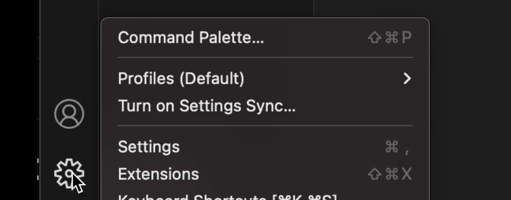
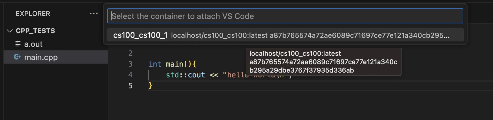
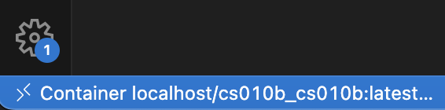

# Podman Installation -- Windows 11

This tutorial will walk you through the steps to install Podman and Podmam-Compose.  You will use Podman and Podman-Compose for container management.

If you fall into any of the following categories, we recommend working with Podman:

1. If you are simply curious about Podman and wish to explore it beyond the classroom setting.
2. If you prefer working on a local machine instead of a remote one.
3. If the remote method is not working as expected for you.
4. If your course instructor has directed you to use Podman.

We advise you to utilize the pre-configured containers available on the UCR servers. This will lead to a smoother and more optimized experience for your specific needs.

## Prerequisites -- Anaconda

Before proceeding with the installation of Podman, it is essential to confirm that certain prerequisites are met. Installing podman-compose on Windows requres a package manager.  This tutorial uses the package manager Conda, which is included in the development platform Anaconda. We will first check for Anaconda, and if necessary, install it before moving forward. This will ensure a smooth and successful installation process. 

Navigate to your terminal, and run <code><b>conda --version</b></code>. If Anaconda is already installed, your terminal will return the current version. Otherwise, you can follow the steps provided in the drop-down list below.

>Note: You can open your terminal by going to your Windows Search Bar and searching "terminal".

<details>
<summary> <b><font size="3">Anaconda Installation</font></b></summary>
To begin the installation, navigate to the <a target="_blank" rel="noopener noreferrer" href="https://www.anaconda.com"> Anaconda homepage </a>.

On the home screen, click the **Download** button with the Windows Icon.  This will download the Anaconda installer. 
<p align="center">
    
</p>

Once the download has finished, start the installer (the .exe file).
>Note: You can find your downloads by pressing (ctrl + j) on your keyboard.

Follow the steps below:
<ol>
   <li>Choose the <b>Next ></b> option on the Welcome page.</li>
   <li>Choose the <b>I Agree</b> option for the license agreement.</li>
   <li>Bubble the <b>Just Me (recommended)</b> option on the Select Installation Type screen.</li>
   <li>Choose the <b>Next ></b> option on the Choose Install Location page.</li>
   <li>Check the <b> Add Anaconda3 to my PATH environment variable</b> option on the Advanced Installation Options page.
    <ol>
      <li>
        <p align="center">
          
        </p>
      </li>
    </ol>
    <li>Click <b>Install</b> on the same page.</li></li>
    <li>Once the installation has finished, click <b>Finish</b>.</li>
</ol>
</details>

<details>
<summary> <font size="3"> <b>Version Output</b></font></summary>
<p align="center">
    
</p>
</details>

## Installing Podman & Podman Compose

With our prerequisites completed, we can now proceed to install Podman. Let's get started by navigating to the <a target="_blank" rel="noopener noreferrer" href="https://github.com/containers/podman/releases"> Podman Github releases page </a>.

Once there, scroll down until you find the **Assets** drop-down tab:
<p align="center">
    
</p>

Look for the file that ends in **setup.exe**, and click on it to download the Podman installer. Once the download is complete, go to your downloads folder and run the file.

In the pop-up, check the box that reads **Install WSL if not present**, and then click **Install**:

<p align="center">
    
</p>

>Note: You may have to restart your computer during this process.

Once the installation is finished, click **Close** to exit the setup. 

To verify that we have successfully installed Podman, run <code><b>podman --version</b></code> in your terminal.

The next step is to install Podman Compose. If you have not installed Anaconda yet, please refer to the instructions [here](#prerequisites----anaconda).

In your terminal, run the following command to install Podman Compose:

```
conda install -c conda-forge podman-compose
```

>Note: If the above command does not work, it is recommended to uninstall Anaconda and then reinstall it using the steps outlined[here](#prerequisites----anaconda)

During the installation, you might encounter a prompt similar to the screenshot below. Type **y** into the terminal to continue:
<p align="center">
    
</p>

After the installation is complete, verify that Podman Compose has been successfully installed by running <code><b>podman-compose --version</b></code>

Congratulations! You've successfully set up Podman and Podman Compose.

## Container Tutorial

This section serves as a tutorial on how to create your first container, which is especially useful for those who are curious about Podman. Additionally, the knowledge gained here will be valuable in effectively managing your future containers for your courses.

Let's start by initializing our machine using the following commands:

```
podman machine init
podman machine start
```
>Note: This process could take a couple minutes. 

To confirm if the machine has been successfully started, execute the following command:

```
podman machine info
```

With the machine up and running, let's now create our first container! In this example, we'll create a "Hello World" container. Run this command: <code><b>podman run --name hello-world-container hello-world</b></code>

Upon successful execution, you will see output similar to this:

<p align="center">
    
</p>

To remove the container, simply run <code><b>podman rm hello-world-container</b></code>

By following these steps, you will have initialized your machine, created and run your first container, and removed it when no longer needed.

## Creating a UCR-associated Container

For this section, it is required to have **git** installed. If you require assistance in getting started and the installation process, please refer to the drop-down list below.

<details>
<summary><font size="3"><b>Git Installation & Mini Tutorial</b></font></summary>
To check if you have git installed, run <code><b>git --version</b></code> in your terminal.

If git is already installed, your terminal will return the current version. Otherwise, run <code><b>brew install git</b></code>
<details>
<summary><font size="3"><b>Version Output</b></font></summary>
<p align="center">
    
</p>
</details>

To navigate your system, the two main commands you will use will be <code><b>cd</b></code> which stands for change directory and <code><b>ls</b></code> which lists the files and directories(folders) in your current directory.

For this section, I recommend creating a folder on your Desktop.

</details>

For each course, there will be a distinct container that needs to be built. It is recommended to create a folder on your Desktop for the following steps.

Before proceeding, ensure you have cloned the <a target="_blank" rel="noopener noreferrer" href="https://github.com/ucrcsedept/course-support/tree/main ">UCR CSE Course Support repository</a> into your system.

You can do the above by navigating into your directory of choice and running the code below:
```
git clone https://github.com/ucrcsedept/course-support.git
```

Once you are in the main directory of the repository, run the following commands:
```
cd containers
ls
cd <class>
```

Execute the following command to build the container specifically for your class: <code><b>podman-compose up -d</b></code>
>Note: This may take a few minutes.

To verify the successful creation of the container, run the following command: <code><b>podman ps</b></code>

To start and stop the container, you can run <code><b>podman start `<coursename>`</b></code> and <code><b>podman stop `<coursename>`</b></code> respectively.

## VSCode Dev Containers Extension

Open VSCode, and navigate to the **Extensions** tab on the left-hand side. Use the search bar to look for the **Dev Containers** extension and install it. 

<p align="center">
    
</p>

Click on the VSCode gear icon located at the bottom left corner and select **Extensions**. For reference, please see the image below: 

<p align="center">
    
</p>

In the search bar (or use "cmd + f"), look for **Docker Path** and replace `docker` with `podman`.
<p align="center">
    
</p>

Go to the search bar again and search for **Docker Compose Path** and replace `docker-compose` with `podman-compose`
<p align="center">
    
</p>

Now that you have completed the initial setup, you can proceed with attaching a container projects you wish to work on.

Open your command pallete ("cmd + shift + p"), and search for `Attach to Running Container ...`. Click on it to initiate the process.
<p align="center">
    
</p>

Afterwards, you will be presented with a list of your availiable containers. Choose the one that fits your best interest.
<p align="center">
    
</p>

It will prompt you to open a new window, and once you do so, you will be developing within the attached container.

By following these steps, you will be all set to efficiently work with containers in your VSCode environment, tailored to your respective course's requirements.

## Developing in a Container
The following tutorial will guide you through creating a simple "Hello World!" program from scratch in your new VSCode Container Window.

First, ensure that you are developing in a container. Check the bottom left corner of your screen; you should see something similar below:
<p align="center">
    
</p>

The above commands will navigate you to the home directory and create a `main.cpp` file.

Next, copy and paste the following snippet of code for a "Hello World!" program:

```
cd home
touch main.cpp
```

The above commands will put you in the home directory and create a `main.cpp` file.

Copy and paste the following for a simple Hello World! program.
```
#include <iostream>

int main()
{
    std::cout << "Hello World!\n";
}
```

To compile our program, run `g++ main.cpp`, then `./a.out`. You should see the output **Hello World!** displayed in your terminal:
<p align="center">
    
</p>

Feel free to replicate these steps for your own project. Happy coding!
