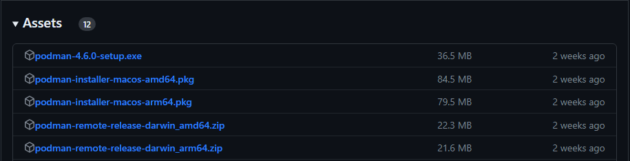

# Podman Installation -- Windows 11

This tutorial will walk you through the steps to install Podman and Podmam-Compose.  You will use Podman and Podman-Compose for container management.

If you fall into any of the following categories, we recommend working with Podman:

1. If you are simply curious about Podman and wish to explore it beyond the classroom setting.
2. If you prefer working on a local machine instead of a remote one.
3. If the remote method is not working as expected for you.
4. If your course instructor has directed you to use Podman.

We advise you to utilize the pre-configured containers available on the UCR servers. This will lead to a smoother and more optimized experience for your specific needs.

## Prerequisites -- Anaconda

Before proceeding with the installation of Podman, it is essential to confirm that certain prerequisites are met. Installing podman-compose on Windows requres a package manager.  This tutorial uses the package manager Conda, which is included in the development platform Anaconda. We will first check for Anaconda, and if necessary, install it before moving forward. This will ensure a smooth and successful installation process. 

Navigate to your terminal, and run <code><b>conda --version</b></code>. 
>Note: You can open your terminal by going to your Windows Search Bar and searching "terminal".

If Anaconda is already installed, your terminal will return the current version. Like this:

<p align="center">
    
</p>

Otherwise, you can follow the steps provided in the drop-down list below.


<details>
<summary> <b><font size="3">Anaconda Installation</font></b></summary>
   
To begin the installation, navigate to the <a target="_blank" rel="noopener noreferrer" href="https://www.anaconda.com"> Anaconda homepage </a>.

Next, on the home screen, click the **Download** button with the Windows Icon.  This will download the Anaconda installer. 
<p align="center">
    
</p>

Once the download has finished, open the installer (the .exe file) from your downloads. After you open the installer, you will be greeted by this screen:
>Note: You can find your downloads by pressing (ctrl + j) on your keyboard.

<p align="center">
    
</p>


Follow the steps below:
<ol>
   <li>Choose the <b>Next ></b> option on the Welcome page.</li>
   <li>Choose the <b>I Agree</b> option for the license agreement.</li>
   <li>Bubble the <b>Just Me (recommended)</b> option on the Select Installation Type screen. You will want to choose this option as it is unnecessary to install Anaconda for other users</li>
   <p align="center">
    
</p>
   <li>Choose the <b>Next ></b> option on the Choose Install Location page.</li>
   <li>Check the <b> Add Anaconda3 to my PATH environment variable</b> option on the Advanced Installation Options page.  While the installer does not recoomend using this setting, this setting is necessary for us to use Anaconda and packages installed using Conda outside of the Anaconda Prompt.
    <ol>
        <p align="center">
          
        </p>
    </ol>
    <li>Click <b>Install</b> on the same page.</li>
    <li>Once the installation has finished, it is not necessary to open the Anaconda Navigator or the Getting Started Guide.  Therefore, click <b>Finish</b> on the final screen shown below.
       <ol>
       <p align="center">
          
        </p>
</ol>

   
Verify the Anaconda was successfully installed by opening a new command prompt window and running <code><b>conda --version</b></code>
</details>

## Installing Podman & Podman Compose

With our prerequisites completed, we can now proceed to install Podman. Let's get started by navigating to the <a target="_blank" rel="noopener noreferrer" href="https://github.com/containers/podman/releases"> Podman Github releases page </a>.

Find the most recent stable release of Podman (indicated by the green "Latest" tag next to the version number).
<p align="center">
    
</p>

Once there, scroll down until you find the **Assets** drop-down tab:
<p align="center">
    
</p>

Look for the file that ends in **setup.exe**, and click on it to download the Podman installer. Once the download is complete, go to your downloads folder and run the file.

In the pop-up, there is a checkbox to isntall the Windows Subsystem for Linux (WSL).  This is necessary to use Podman.  So, check the box that reads **Install WSL if not present**, and then click **Install**:

<p align="center">
    
</p>

>Note: You may have to restart your computer during this process.

Once the installation is finished, click **Close** to exit the setup. 

To verify that we have successfully installed Podman, run <code><b>podman --version</b></code> in your terminal.

The next step is to install Podman Compose. If you have not installed Anaconda yet, please refer to the instructions  [here](#prerequisites----anaconda).

In your terminal, run the following command to install Podman Compose:

```
conda install -c conda-forge podman-compose
```

>Note: If the above command does not work, it is recommended to uninstall Anaconda and then reinstall it using the steps outlined [here](#prerequisites----anaconda)

During the installation, you might encounter a prompt similar to the screenshot below. Type **y** into the terminal to continue:
<p align="center">
    
</p>

After the installation is complete, verify that Podman Compose has been successfully installed by running <code><b>podman-compose --version</b></code>

Congratulations! You've successfully set up Podman and Podman Compose.

