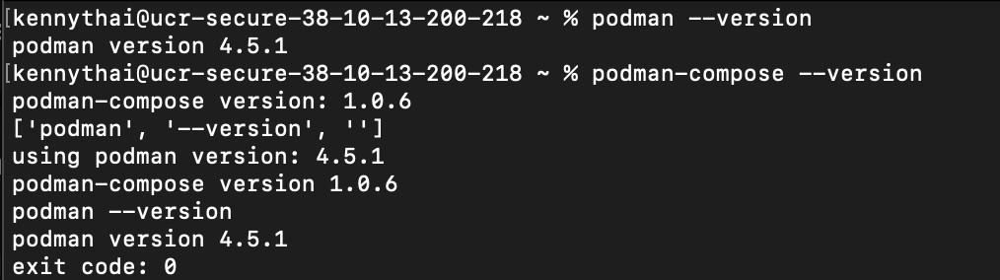
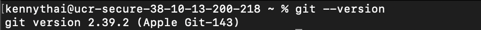
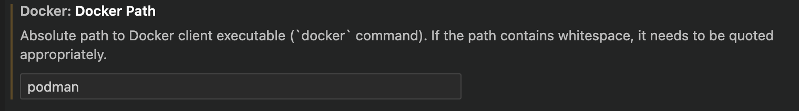
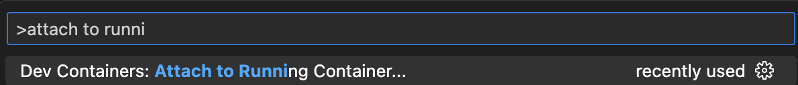

# Podman Installation -- macOS: Ventura 

If you fall into any of the following categories, we recommend working with Podman:

1. If you are simply curious about Podman and wish to explore it beyond the classroom setting.
2. If you prefer working on a local machine instead of a remote one.
3. If the remote method is not working as expected for you.

We advise you to utilize the pre-configured containers available on the UCR servers. This will lead to a smoother and more optimized experience for your specific needs.

## Prerequisites -- Xcode

Before proceeding with the installation of Podman, it is essential to confirm that certain prerequisites are met. We will first check for Xcode and Homebrew, and if necessary, install them before moving forward. This will ensure a smooth and successful installation process.

Navigate to your terminal, and run <code><b>xcode-select --version</b></code>

>Note: You can open the terminal by either pressing cmd + space and searching for "terminal" or by navigating to your launchpad and searching for "terminal."

If Xcode is already installed, your terminal will return the current version. Otherwise, you can follow the steps provided in the drop-down list below.

<details>
<summary> <b><font size="3">Xcode Installation</font></b></summary>
To install XCode, run <code><b>xcode-select --install</b></code> in your terminal. After running the command, a pop-up will appear. Follow the steps below to ensure a smooth installation.
<ol>
   <li>Choose the "Install" option.</li>
   <li>Click "Agree" to the license agreement.</li>
   <li>XCode will begin the installation process. This may take a few minutes.</li>
   <li>Click "Done" on the pop-up that confirms the software has been installed. </li>
</ol>

To check if the installation was successful, run <code> <b> xcode-select --version </b> </code> 

The terminal should output the current version of Xcode.

</details>
<details>
<summary> <font size="3"> <b>Version Output</b></font></summary>
<p align="center">
    
</p>
</details>

## Prerequisites -- Homebrew

The second requirement for Podman is Homebrew. To check if you have Homebrew installed on your system, enter <code><b>brew --version</b> </code>in your terminal.

>Note: A clear indication that it is not installed is when you encounter the following error message: <code>zsh: command not found: brew</code>

If Homebrew is already installed, your terminal will return the current version. Otherwise, you can follow the steps provided in the drop-down list below.

<details>
<summary> <b><font size="3">Homebrew Installation</font></b> </summary>

To begin the installation, navigate to the <a target="_blank" rel="noopener noreferrer" href="https://brew.sh/"> Homebrew page </a>.

You will now see the following:

<p align="center">
    
</p>

To copy the script, simply click on the <b>clipboard icon</b> located to the right of the command, and then paste and run it directly in your terminal.

The terminal may prompt you for <code>sudo access</code>. Enter the admin password to the terminal. You may not see the characters you are typing; this is normal.
>Note: Your admin password is the same password you use to log into your Mac.

After entering your password, a list will be displayed showing what is going to be installed and where. Press the **return** key on your keyboard to continue. The installation will now begin and may take a few minutes.

Once Homebrew has been installed, locate the following lines
```
==> Next steps:
- Run these two commands in your terminal to add Homebrew to your PATH:
    (echo; echo 'eval "$(/opt/homebrew/bin/brew/ shellenv)"') >> /Users/kennythai/.zprofile
    eval "$(/opt/homebrew/bin/brew shellenv)"
```
The two commands will vary slightly for every system. **DO NOT COPY** the commands from above, but instead the ones from your own terminal.

Copy and paste the first line into your terminal. In this case, the first line is <code>(echo; echo 'eval "$(/opt/homebrew/bin/brew/ shellenv)"') >> /Users/kennythai/.zprofile</code>

Copy and paste the second line into your terminal. In this case, the second line is <code>eval "$(/opt/homebrew/bin/brew shellenv)"</code>

Once you have completed the previous steps, confirm the successful installation of Homebrew by running <code><b>brew --version</b></code>

</details>
<details>
<summary><font size="3"><b>Version Output</b></font></summary>
<p align="center">
    
</p>
</details>

## Installing Podman

With our prerequisites completed, we can now proceed to install Podman. To get started, navigate to your terminal and run <code><b>brew install podman</b></code>

After the prior installation has finished, proceed to run <code><b>brew install podman-compose</b></code>

By following these steps, you will have successfully installed Podman and Podman Compose on your system. To double-check, execute the following two commands and check if they produce any output:

```
podman --version
podman-compose --version
```
</details>
<details>
<summary><font size="3"><b>Version Output</b></font></summary>
<p align="center">
    
</p>
</details>

## Container Tutorial

This section serves as a tutorial on how to create your first container, which is especially useful for those who are curious about Podman. Additionally, the knowledge gained here will be valuable in effectively managing your future containers for your courses.

Let's start by initializing our machine using the following commands:

```
podman machine init
podman machine start
```
>Note: This process could take a couple minutes. 

To confirm if the machine has been successfully started, execute the following command:

```
podman machine info
```

With the machine up and running, let's now create our first container! In this example, we'll create a "Hello World" container. Run this command: <code><b>podman run --name hello-world-container hello-world</b></code>

Upon successful execution, you will see output similar to this:

<p align="center">
    
</p>

To remove the container, simply run <code><b>podman rm hello-world-container</b></code>

By following these steps, you will have initialized your machine, created and run your first container, and removed it when no longer needed.

## Creating a UCR-associated Container

For this section, it is required to have **git** installed. If you require assistance in getting started and the installation process, please refer to the drop-down list below.

<details>
<summary><font size="3"><b>Git Installation & Mini Tutorial</b></font></summary>
To check if you have git installed, run <code><b>git --version</b></code> in your terminal.

If git is already installed, your terminal will return the current version. Otherwise, run <code><b>brew install git</b></code>
<details>
<summary><font size="3"><b>Version Output</b></font></summary>
<p align="center">
    
</p>
</details>

To navigate your system, the two main commands you will use will be <code><b>cd</b></code> which stands for change directory and <code><b>ls</b></code> which lists the files and directories(folders) in your current directory.

For this section, I recommend creating a folder on your Desktop.

</details>

For each course, there will be a distinct container that needs to be built. It is recommended to create a folder on your Desktop for the following steps.

Before proceeding, ensure you have cloned the <a target="_blank" rel="noopener noreferrer" href="https://github.com/ucrcsedept/course-support/tree/main ">UCR CSE Course Support repository</a> into your system.

You can do the above by navigating into your directory of choice and running the code below:
```
git clone https://github.com/ucrcsedept/course-support.git
```

Once you are in the main directory of the repository, run the following commands:
```
cd containers
ls
cd <class>
```

Execute the following command to build the container specifically for your class: <code><b>podman-compose up -d</b></code>
>Note: This may take a few minutes.

To verify the successful creation of the container, run the following command: <code><b>podman ps</b></code>

To start and stop the container, you can run <code><b>podman start `<coursename>`</b></code> and <code><b>podman stop `<coursename>`</b></code> respectively.

## VSCode Dev Containers Extension

Open VSCode, and navigate to the **Extensions** tab on the left-hand side. Use the search bar to look for the **Dev Containers** extension and install it. 

<p align="center">
    
</p>

Click on the VSCode gear icon located at the bottom left corner and select **Extensions**. For reference, please see the image below: 

<p align="center">
    
</p>

In the search bar (or use "cmd + f"), look for **Docker Path** and replace `docker` with `podman`.
<p align="center">
    
</p>

Go to the search bar again and search for **Docker Compose Path** and replace `docker-compose` with `podman-compose`
<p align="center">
    
</p>

Now that you have completed the initial setup, you can proceed with attaching a container projects you wish to work on.

Open your command pallete ("cmd + shift + p"), and search for `Attach to Running Container ...`. Click on it to initiate the process.
<p align="center">
    
</p>

Afterwards, you will be presented with a list of your availiable containers. Choose the one that fits your best interest.
<p align="center">
    
</p>

It will prompt you to open a new window, and once you do so, you will be developing within the attached container.

By following these steps, you will be all set to efficiently work with containers in your VSCode environment, tailored to your respective course's requirements.

## Developing in a Container
The following tutorial will guide you through creating a simple "Hello World!" program from scratch in your new VSCode Container Window.

First, ensure that you are developing in a container. Check the bottom left corner of your screen; you should see something similar below:
<p align="center">
    
</p>

The above commands will navigate you to the home directory and create a `main.cpp` file.

Next, copy and paste the following snippet of code for a "Hello World!" program:

```
cd home
touch main.cpp
```

The above commands will put you in the home directory and create a `main.cpp` file.

Copy and paste the following for a simple Hello World! program.
```
#include <iostream>

int main()
{
    std::cout << "Hello World!\n";
}
```

To compile our program, run `g++ main.cpp`, then `./a.out`. You should see the output **Hello World!** displayed in your terminal:
<p align="center">
    
</p>

Feel free to replicate these steps for your own project. Happy coding!

## Potential Errors and Troubleshooting

### <u><b>Podman Machine and Container Errors</b></u>

This first part will include errors you may receive when starting your machine or container. If your error is unrelated to this and related to an issue in VSCode navigate [here](#vscode-extension-errors).

Here are some common errors you may encounter and the corresponding troubleshooting steps:
* <b>Error: failed to connect: dial tcp 127.0.0.1:53132: connect: connection refused</b>
* Stuck on <b>Waiting for VM ...</b>
* <b>Error: podman-machine-default: VM already exists</b>
* <b> Error: cannot start VM podman-machine-default: VM already running or starting </b>

To start, you can check if your machine is already running by using the following command:

```
podman machine info
```

Furthermore, you can determine which containers are currently in use with:

```
podman ps
```

These two commands will often help you identify the conflict as your machine and container is already running in the background. 

If you're still unable to identify the error, you can try the following commands to stop and remove the machine:

```
podman machine stop
podman machine rm
```

Afterward, restart the machine using:

```
podman machine init
podman machine start
```

Keep in mind that you may need to rebuild any containers that were lost during this process. You can find a reminder on how to do this [here](#creating-a-ucr-associated-container).
