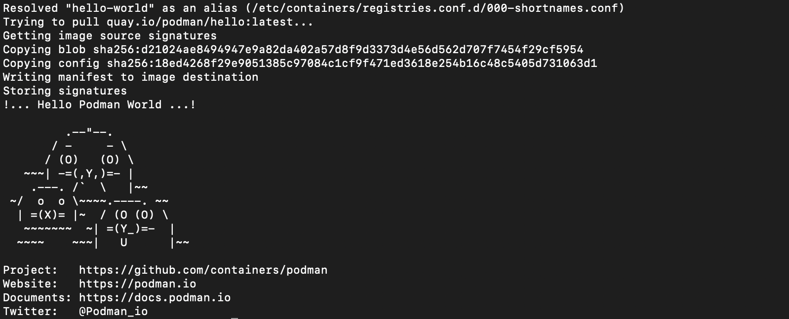
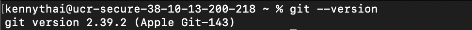
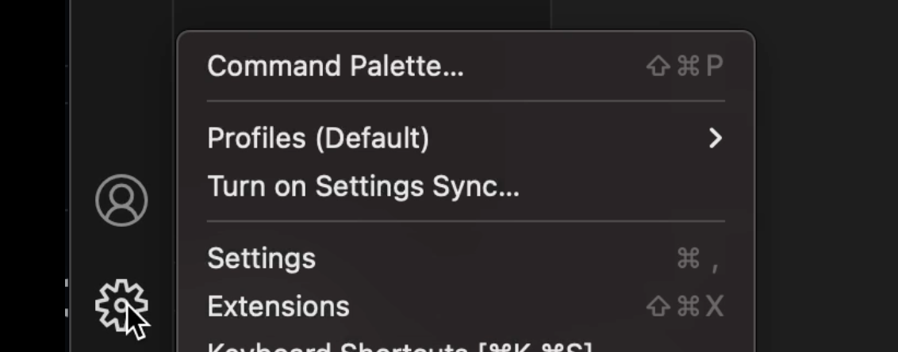
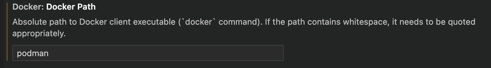
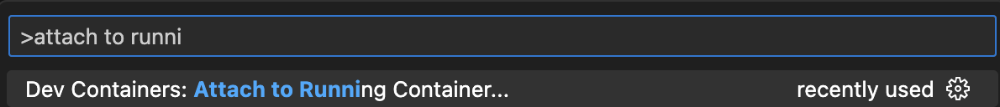
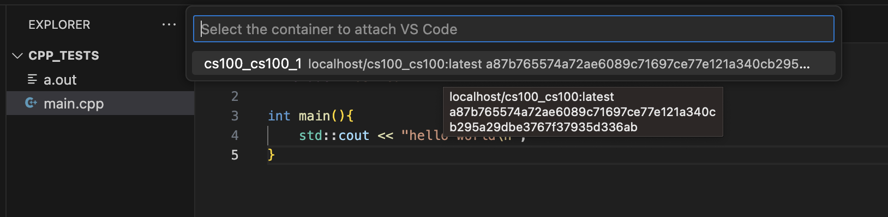
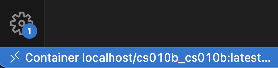
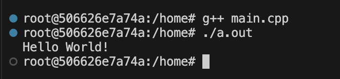

# Container Tutorial

This is a tutorial on how to create your first container, which is especially useful for those who are curious about Podman or will need to use Podman for a course. Additionally, the knowledge gained here will be valuable in effectively managing your future containers for your courses.

On Windows devices and Macs, podman uses a virtual machine to create ad run containers.  Let's start by initializing and starting our machine using entering following commands in a terminal:

```
podman machine init
podman machine start
```
>Note: This process could take a couple minutes. 

This creates a podman machine with the default name "podman-machine-default". 
To confirm if the machine has been successfully started, execute the following command:

```
podman machine info
```

Now that the machine has started, it can be started/stopped at any time using <code><b>podman machine start</b></code> and <code><b>podman machine stop</b></code>


With the machine up and running, let's now create our first container! In this example, we'll create a "Hello World" container. Run this command: <code><b>podman run --name hello-world-container hello-world</b></code>
The <code><b>--name</b></code> flag sets the name of the created container to <code><b>hello-world-container</b></code>.  <code><b>hello-world</b></code> is the name of the image that podman uses to create the container.  This image is a testing tool to verify that everything is working properly.

Upon successful execution, you will see output similar to this:

<p align="center">
    
</p>

To save space/resources, remove the container using <code><b>podman rm hello-world-container</b></code>

By following these steps, you will have initialized your machine, created and run your first container, and removed it when no longer needed.

## Creating a UCR-associated Container using files stored in a GitHub Repository

For this section, it is required to have **git** installed.  Git is a powerful tool to have as you will need it to interact with UCR's courses GitHub files.  Git is typcially preinstalled on Macs.  However, it is not preinstalled on Windows devices.  To check if you have git installed, run <code><b>git --version</b></code> in your terminal.

If git is already installed, your terminal will return the current version, similar to this:
<p align="center">
    
</p>

Otherwise, you will need to install Git.  The installation process is different for Macs and Windows.  Please refer to the drop-down list below.

<details>
<summary><font size="3"><b>Git Installation for Macs</b></font></summary>
If you don't have Git installed on your Mac, running <code><b>git --version</b></code> will prompt you to install/activate Git on most versions of macOS.  In this scenarion, follow the insturcitons given to you in the terminal.

Otherwise, if you were not prompted to install Git, you can install Git using Homewbrew.  Run the command <code><b>brew install git</b></code>
</details>

<details>
<summary><font size="3"><b>Git Installation for Windows</b></font></summary>  
   
Visit the <a href="https://git-scm.com/download/win">Git Windows Installer download</a>.


</details>


run <code><b>brew install git</b></code>

In terminal or command prompt windows, you may need to navigate to the location where files are stored. To navigate your system, the two main commands you will use will be <code><b>cd</b></code> which stands for change directory and <code><b>ls</b></code> which lists the files and directories(folders) in your current directory.

For this section, I recommend creating a folder on your Desktop.

</details>

For each course, there will be a distinct container that needs to be built. It is recommended to create a folder on your Desktop for the following steps.

Before proceeding, ensure you have cloned the <a target="_blank" rel="noopener noreferrer" href="https://github.com/ucrcsedept/course-support/tree/main ">UCR CSE Course Support repository</a> into your system.

You can do the above by navigating into your directory of choice and running the code below:
```
git clone https://github.com/ucrcsedept/course-support.git
```

Once you are in the main directory of the repository, run the following commands:
```
cd containers
ls
cd <class>
```

Execute the following command to build the container specifically for your class: <code><b>podman-compose up -d</b></code>
>Note: This may take a few minutes.

To verify the successful creation of the container, run the following command: <code><b>podman ps</b></code>

To start and stop the container, you can run <code><b>podman start `<coursename>`</b></code> and <code><b>podman stop `<coursename>`</b></code> respectively.

## VSCode Dev Containers Extension

Open VSCode, and navigate to the **Extensions** tab on the left-hand side. Use the search bar to look for the **Dev Containers** extension and install it. 

<p align="center">
    
</p>

Click on the VSCode gear icon located at the bottom left corner and select **Extensions**. For reference, please see the image below: 

<p align="center">
    
</p>

In the search bar (or use "cmd + f"), look for **Docker Path** and replace `docker` with `podman`.
<p align="center">
    
</p>

Go to the search bar again and search for **Docker Compose Path** and replace `docker-compose` with `podman-compose`
<p align="center">
    
</p>

Now that you have completed the initial setup, you can proceed with attaching a container projects you wish to work on.

Open your command pallete ("cmd + shift + p"), and search for `Attach to Running Container ...`. Click on it to initiate the process.
<p align="center">
    
</p>

Afterwards, you will be presented with a list of your availiable containers. Choose the one that fits your best interest.
<p align="center">
    
</p>

It will prompt you to open a new window, and once you do so, you will be developing within the attached container.

By following these steps, you will be all set to efficiently work with containers in your VSCode environment, tailored to your respective course's requirements.

## Developing in a Container
The following tutorial will guide you through creating a simple "Hello World!" program from scratch in your new VSCode Container Window.

First, ensure that you are developing in a container. Check the bottom left corner of your screen; you should see something similar below:
<p align="center">
    
</p>

The above commands will navigate you to the home directory and create a `main.cpp` file.

Next, copy and paste the following snippet of code for a "Hello World!" program:

```
cd home
touch main.cpp
```

The above commands will put you in the home directory and create a `main.cpp` file.

Copy and paste the following for a simple Hello World! program.
```
#include <iostream>

int main()
{
    std::cout << "Hello World!\n";
}
```

To compile our program, run `g++ main.cpp`, then `./a.out`. You should see the output **Hello World!** displayed in your terminal:
<p align="center">
    
</p>

Feel free to replicate these steps for your own project. Happy coding!


