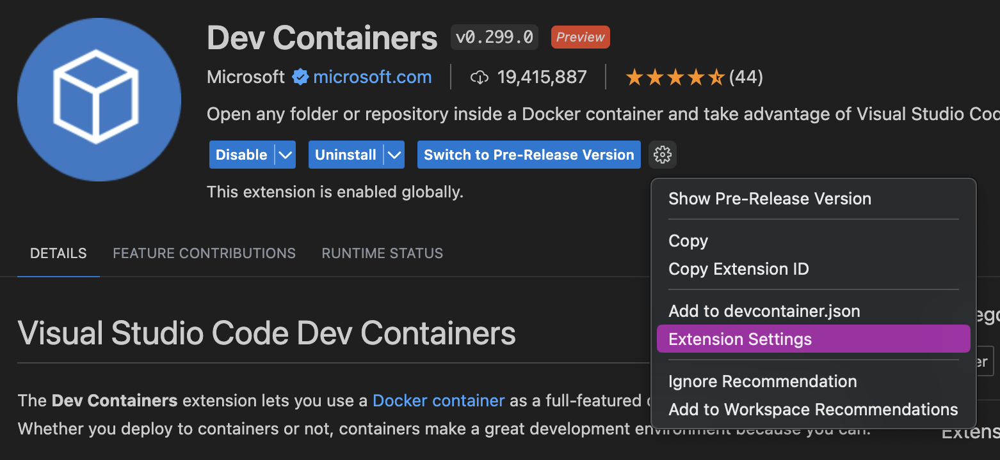

# Container Tutorial

This is a tutorial on how to create your first container, which is especially useful for those who are curious about Podman or will need to use Podman for a course. Additionally, the knowledge gained here will be valuable in effectively managing your future containers for your courses.

On Windows devices and Macs, podman uses a virtual machine to create ad run containers.  Let's start by initializing and starting our machine using entering following commands in a terminal:

```
podman machine init
podman machine start
```
>Note: This process could take a couple minutes. 

This creates a podman machine with the default name "podman-machine-default". 
To confirm if the machine has been successfully started, execute the following command:

```
podman machine info
```

Now that the machine has started, it can be started/stopped at any time using <code><b>podman machine start</b></code> and <code><b>podman machine stop</b></code>


With the machine up and running, let's now create our first container! In this example, we'll create a "Hello World" container. Run this command: <code><b>podman run --name hello-world-container hello-world</b></code>
The <code><b>--name</b></code> flag sets the name of the created container to <code><b>hello-world-container</b></code>.  <code><b>hello-world</b></code> is the name of the image that podman uses to create the container.  This image is a testing tool to verify that everything is working properly.

Upon successful execution, you will see output similar to this:

<p align="center">
    
</p>

To save space/resources, remove the container using <code><b>podman rm hello-world-container</b></code>

By following these steps, you will have initialized your machine, created and run your first container, and removed it when no longer needed.

## Creating a UCR-associated Container using files stored in a GitHub Repository

For this section, it is required to have **git** installed.  Git is a powerful tool to have as you will need it to interact with UCR's courses GitHub files.  Git is typcially preinstalled on Macs.  However, it is not preinstalled on Windows devices.  To check if you have git installed, run <code><b>git --version</b></code> in your terminal.

If git is already installed, your terminal will return the current version, similar to this:
<p align="center">
    
</p>

Otherwise, you will need to install Git.  The installation process is different for Macs and Windows.  Please refer to the drop-down list below.

<details>
<summary><font size="3"><b>Git Installation for Macs</b></font></summary>
If you don't have Git installed on your Mac, running <code><b>git --version</b></code> will prompt you to install/activate Git on most versions of macOS.  In this scenarion, follow the insturcitons given to you in the terminal.

Otherwise, if you were not prompted to install Git, you can install Git using Homewbrew.  Run the command <code><b>brew install git</b></code>

Verify that Git was successfully installed using the <code><b>git --version</b></code> command.
</details>

<details>
<summary><font size="3"><b>Git Installation for Windows</b></font></summary>  
   
Visit the <a href="https://git-scm.com/download/win">Git Windows Installer download</a> and download the standalone installer for the version of Windows you have (64-bit or 32-bit).
>Note: If you are unsure which version of Windows you have, press the hotkey 'Windoes Key + I' to open your stystem settings.  Select the 'System' setting and scroll to the bottom of the left panel until you see an 'About' section. Click on it.  Under 'Device Specifications', there will be a 'System Type' label that says whether you have have a 64-bit or 32-bit device.

Open the installer.

You do not need to change any installation settings for Git, so you click 'Continue' in the bottom right of the installer until you are prompted to install Git.

Click 'Install' and wait for Git to finish installing.

Once Git is infinished installing, you can close out of the installer and verify that Git was successfully installed using the <code><b>git --version</b></code> command.

</details>

The next part requires that you navigate to the location where files are stored using a termintal. To navigate your system, the two main commands you will use will be <code><b>cd</b></code> which stands for change directory and <code><b>ls</b></code> which lists the files and directories(folders) in your current directory.

For each course, there will be a distinct container that needs to be built.  It is reommended to create a folder on your Desktop to put the cloned repository.

After you have created the folder, clone the course-support repository onto your device into the current directory using the command:
```
git clone https://github.com/ucrcsedept/course-support.git
```

In the terminal/command prompt, navigate to the cloned repository using the command:
```
cd DIRECTORYNAME
```
For the course support repository, the directory name will be <code><b>course-support</b></code>. 

Change directories to the `containers` directory using `cd` once again.  For this tutorial, we'll be creating a container using the cs100 dockerfile, so use the command `cs100` to change directories into the cs100 folder.
>Note: You can replicate these steps for any course by simply using the name of the course you are taking.  

From the `cs100` folder, use `podman-compose` to create a container using the files inside the current directory.  To do this, run the command:
```
podman-compose up -d
```

This command will build AND run the container. The `-d` flag indicates that the container will run in detached mode.  This means that the current terminal window ill not attach to the container, instead, the container will run in the background.
>Note: This may take a few minutes.

To verify the successful creation of the container, run the following command: <code><b>podman ps</b></code>, which outputs a list of all currently running containers.  If you see a container on the list, you have successfully created your container!

To start and stop the container, you can run <code><b>podman start `<coursename>`</b></code> and <code><b>podman stop `<coursename>`</b></code> whenever necessary.

## VSCode Dev Containers Extension
Now that a container is running, you will need to do something with it.  Usually, this will be running or testing code you wrote. To do this, you will use an enviornment to write your code.  We suggeest VSCode.  If you don't currently have VSCode installed or are not familiar with VSCode, please view the `README` file in the vscode folder in the `course-support` repository. 

Once VSCode is installed, we need to be setup to attach the container so we can develop inside of it. To do this open VSCode, and navigate to the **Extensions** tab on the left-hand side. The Extensions tab looks like :
<p align="center">
    
</p>

Use the search bar to look for the **Dev Containers** extension and install it. After it is installed, click on the VSCode gear icon located to the right of the `Switch to Pre-Release Version` button and select **Extension Settings**. For reference, please see the image below: 
<p align="center">
    
</p>

In the search bar at the top (or use "cmd + f"), look for **Dev > Containers: Docker Path** and replace `docker` with `podman`.
<p align="center">
    
</p>

Go to the search bar again and search for **Dev > Containers: Docker Compose Path** and replace `docker-compose` with `podman-compose`
<p align="center">
    
</p>

Dev Containers will not work with Podman if these settings are not adjusted, so ensure that they are correctly changed.

Now that you have completed the initial setup, you can proceed with attaching a container projects you wish to work on.

Open your command pallete ("cmd + shift + p"), and search for `Attach to Running Container ...`. Click on it to initiate the process.
<p align="center">
    
</p>

Afterwards, you will be presented with a list of your availiable containers. Choose the one that fits your best interest.
<p align="center">
    
</p>

It will prompt you to open a new window, and once you do so, you will be developing within the attached container.

By following these steps, you will be all set to efficiently work with containers in your VSCode environment, tailored to your respective course's requirements.

## Developing in a Container
The following tutorial will guide you through creating a simple "Hello World!" program from scratch in your new VSCode Container Window.

When you open a container for the first time, VSCode will show a home page with no folders opened:
<p align="center">
    
</p>

Click the `Open` button in the middle of the welcome sreen with a folder next to it.  This will open a window to slect a folder to open.  The window will displaye the `/root/` directory.
<p align="center">
    
</p>

Click on the two dots `..` to move up to the parent directory.  Then locate the `home` file and open it.
<p align="center">
    
</p>

Once you open the Home directory, the sidebar will display that you are in the home directory, which is currently empty.
<p align="center">
    
</p>

Click the leftmost button on the file editor bar to create a new file and name it `main.cpp`.
<p align="center">
    
</p>

Next, copy and paste the following snippet of code into the file you just created.
```
#include <iostream>

using namespace std;

int main()
{
    cout << "Hello World!" << endl;
    return 0;
}
```


To compile our program, you need to open a terminal.  Click the Terminal dropdown button in the menu bar and create a new terminal.  This will createa  new terminal screen at the bottom run `g++ main.cpp`, then `./a.out`. You should see the output **Hello World!** displayed in your terminal:
<p align="center">
    
</p>

Feel free to replicate these steps for your own project. Happy coding!


