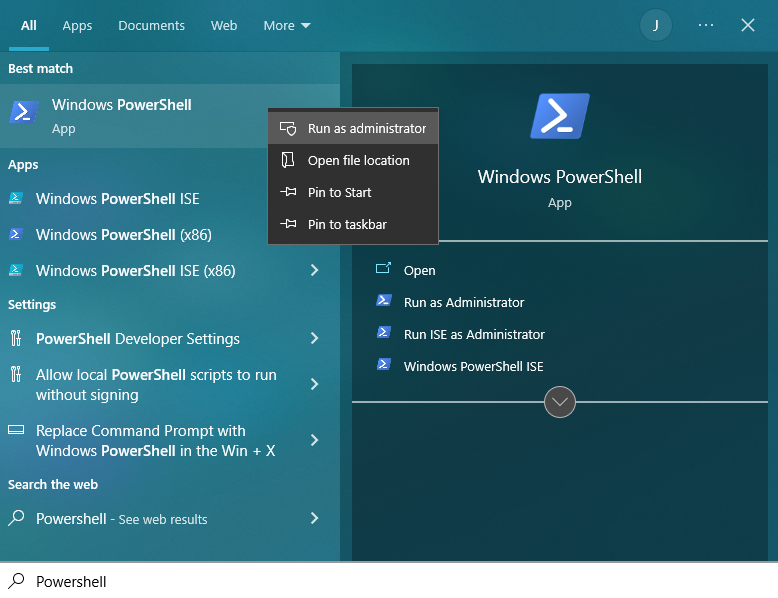

## Accessing Containers on Local Machine with Docker

> Note: Virtualization must be enabled on your machine for this to work (usually enabled by default on most machines).

We recommend this method if you are just curious about Docker and want to use it outside of class, if you prefer working on a local machine rather than a remote one, or if the remote method isn't working for you. In all other cases, we recommend you use the containers that are already configured for you on the UCR servers. 

The first thing you must do is install Docker, which is OS-specific. Click the dropdown for your operating system, and follow the instructions to install Docker.

<details>
<summary>Windows</summary>

1. First, install [Docker Desktop](https://www.docker.com/products/docker-desktop/) here for your appropriate OS and processor. You may need to create an account.

2. Open a Powershell terminal as admin by going to the start menu, searching for Powershell, right clicking Powershell, and click Run as Administrator.

<p align="center">
   
</p>

3. Run these commands within the Powershell terminal:

```
dism.exe /online /enable-feature /featurename:Microsoft-Windows-Subsystem-Linux /all /norestart
dism.exe /online /enable-feature /featurename:VirtualMachinePlatform /all /norestart
```

4. Download the Linux kernel update package [here](https://docs.microsoft.com/pl-pl/windows/wsl/install-manual#step-4---download-the-linux-kernel-update-package). Run the file you download from there.

5. Run this command in your Powershell. 

```
wsl --set-default-version 2
```

Now, Docker should be fully working on your computer. To test this, open up Docker Desktop, then open up a command prompt and type this command:

```
docker run --name hello-world-container hello-world
```

The output should be something like:
```
Hello from Docker!
This message shows that your installation appears to be working correctly.

To generate this message, Docker took the following steps:
 1. The Docker client contacted the Docker daemon.
 2. The Docker daemon pulled the "hello-world" image from the Docker Hub.
    (amd64)
 3. The Docker daemon created a new container from that image which runs the
    executable that produces the output you are currently reading.
 4. The Docker daemon streamed that output to the Docker client, which sent it
    to your terminal.

To try something more ambitious, you can run an Ubuntu container with:
 $ docker run -it ubuntu bash

Share images, automate workflows, and more with a free Docker ID:
 https://hub.docker.com/

For more examples and ideas, visit:
 https://docs.docker.com/get-started/
```

To save space/resources, remove the container.
```
docker rm hello-world-container
```

</details>

<details>
<summary>MacOS</summary>

1. First, install [Docker Desktop](https://www.docker.com/products/docker-desktop/) here for your appropriate OS and processor. You may need to create an account.

2. Open the `docker.dmg` file. After it opens, you should see a window like this:

<p align="center">
    
</p>

In the window, drag and drop the Docker icon to the folder, and it will automatically add Docker Desktop to your applications folder.

3. Go to your applications folder, and open Docker Desktop. It should ask for your system password since Docker requires admin access.

Now, Docker should be fully working on your computer. To test this, open up Docker Desktop, then open up a command prompt and type this command:

```
docker run --name hello-world-container hello-world
```

The output should be something like:
```
Hello from Docker!
This message shows that your installation appears to be working correctly.

To generate this message, Docker took the following steps:
 1. The Docker client contacted the Docker daemon.
 2. The Docker daemon pulled the "hello-world" image from the Docker Hub.
    (amd64)
 3. The Docker daemon created a new container from that image which runs the
    executable that produces the output you are currently reading.
 4. The Docker daemon streamed that output to the Docker client, which sent it
    to your terminal.

To try something more ambitious, you can run an Ubuntu container with:
 $ docker run -it ubuntu bash

Share images, automate workflows, and more with a free Docker ID:
 https://hub.docker.com/

For more examples and ideas, visit:
 https://docs.docker.com/get-started/
```

To save space/resources, remove the container.
```
docker rm hello-world-container
```

</details>

<details>
<summary>Linux (Ubuntu)</summary>

> Note: These instructions are for Ubuntu. If you have a different distribution, find the instructions [here](https://docs.docker.com/desktop/install/linux-install/).

1. Run the following commands:

```bash
sudo apt-get update

sudo apt-get install \
    ca-certificates \
    curl \
    gnupg \
    lsb-release

sudo mkdir -p /etc/apt/keyrings

curl -fsSL https://download.docker.com/linux/ubuntu/gpg | sudo gpg --dearmor -o /etc/apt/keyrings/docker.gpg

echo \
  "deb [arch=$(dpkg --print-architecture) signed-by=/etc/apt/keyrings/docker.gpg] https://download.docker.com/linux/ubuntu \
  $(lsb_release -cs) stable" | sudo tee /etc/apt/sources.list.d/docker.list > /dev/null

sudo apt-get update

sudo apt-get install docker-ce docker-ce-cli containerd.io docker-compose-plugin

sudo apt-get install docker-ce=5:20.10.17~3-0~ubuntu-focal docker-ce-cli=5:20.10.17~3-0~ubuntu-focal containerd.io docker-compose-plugin

# Note that, at the writing of this module, the latest version of Docker was 5:20.10.17~3-0~ubuntu-focal. If you want to install the latest version of Docker, run the command: apt-cache madison docker-ce

# ... then replace the version string 5:20.10.17~3-0~ubuntu-focal with the version string of the latest version.

```

These commands will install the Docker Engine. To ensure that it was installed correctly, run this command:

```
sudo docker run hello-world
```

The output should look something like this:

```
Hello from Docker!
This message shows that your installation appears to be working correctly.

To generate this message, Docker took the following steps:
 1. The Docker client contacted the Docker daemon.
 2. The Docker daemon pulled the "hello-world" image from the Docker Hub.
    (amd64)
 3. The Docker daemon created a new container from that image which runs the
    executable that produces the output you are currently reading.
 4. The Docker daemon streamed that output to the Docker client, which sent it
    to your terminal.

To try something more ambitious, you can run an Ubuntu container with:
 $ docker run -it ubuntu bash

Share images, automate workflows, and more with a free Docker ID:
 https://hub.docker.com/

For more examples and ideas, visit:
 https://docs.docker.com/get-started/
```

OPTIONAL STEP: If you don't want to `sudo` every time you run Docker, run these commands:

```bash
sudo groupadd docker
sudo usermod -aG docker $USER
# Log out and log back in after running the above command
newgrp docker 
```

You should now be able to run Docker without `sudo`. Try running the hello world container without `sudo` to confirm.

3. While technically optional to install, Docker Deskop provides a very useful graphical interface to keep track of containers and images, and an easy way to run/stop containers.

Download the latest version of Docker Desktop for your distribution [here](https://docs.docker.com/desktop/release-notes/).

4. Install the package using `apt` (make sure you are in the directory where the Docker Desktop package was downloaded):

```bash
sudo apt-get update
sudo apt-get install ./[NAME_OF_FILE_DOWNLOADED]

# For example, the latest version at the writing of this module was docker-desktop-4.12.0-amd64.deb, so the command was...
# sudo apt-get install ./docker-desktop-4.12.0-amd64.deb
```

You should now be able to open Docker Desktop.

</details>

> Note: Make sure Docker Desktop is open before doing anything below!

Now that Docker is set up, open VSCode and install two extensions: "Docker" and "Remote - Containers". Both should be verified by Microsoft. Now, create a folder for the course you are taking that is using containers. In this folder, you need to add a `Dockerfile` and a `docker-compose.yml` file. Those two files should have been given to you by an instructor, otherwise, they can be found [here](../../docker/) at this folder.

Once you have the two required files, put them into their own folder, then open that folder in VSCode. We need to use these files to create the image that our container will be based on. To do that, run this command in your VSCode terminal (make sure you are in the folder with the `Dockerfile` and `docker-compose.yml` file):

```
docker compose up -d
```

> Note: A very useful feature of Docker is that because images are composed of different layers, adding layers to an image then rebuilding that image will not take nearly as long as creating the inital image due to caching.

Depending on your course and how much software it requires, creating the image may take a while. Once this is done, open the Command Palette by going to View > Command Palette, then type in "Remote - Containers: Open Folder in Container". You will be prompted to select a folder. Select the folder that contains the `Dockerfile` and the `docker-compose.yml` files. You will see a prompt asking you what to base the container on. Click on "From Dockerfile". A new instance of VSCode will open, and Docker will build the container based on the image. Once it is done, you will now be placed in the container. To know that this was successful, open a terminal, and the user should read something like this:

```
root@d4a9db64886f:/workspaces/[course_name_here]#
```

Now, you are in your course container with the VSCode interface!

For Windows, a video example of configuring Docker and setting up a container locally can be found here. If you are not on Windows, the second half of the video may be helpful as they contain the steps taken in VSCode. 

[](https://www.youtube.com/watch?v=UJTSJiH0CnM)
