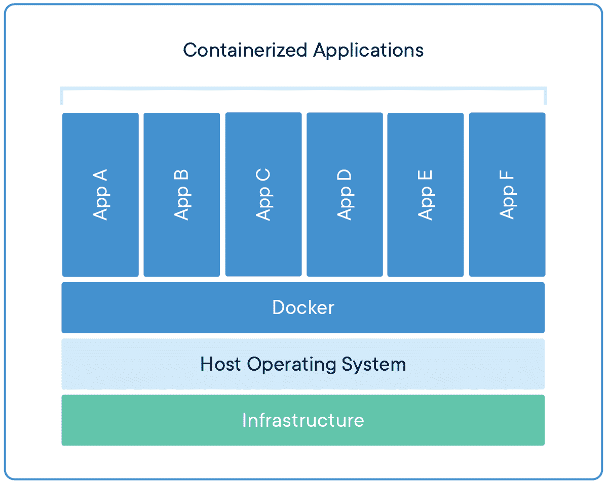

To go back to the container/Docker setup tutorial, click [here](README.md).

## What is Containerization?

When software is being developed in a specific environment, deploying or transferring the code for that software may result in bugs and errors ("But it works on my machine!"). A common example of when this problem happens is when code is transferred between two different operating systems, or two different processor architectures (x86 vs ARM). This problem is directly addressed with something called containerization, which is when we package that same code with the necessary operating system libraries and dependencies into a small, lightweight exectuable called a container that can be run on any computer. Being able to package your applications in this manner is very important because it is impossible to replicate all the conditions that you have on your local machine on others. Containers use virtualization (not to be confused with VMs) to create these small, isolated development environments. 

### Containers vs Virtual Machines

While containers are very similar to a VM in that they both allow you to run applications on any machine in isolation with all dependencies and required software, VMs require a whole OS, which means they are very slow and resource heavy. Containers are built from images, which can be thought of as a lightweight version of an OS that has only the required processes and dependencies to run the application, making them much faster and take up less resources. Essentially, containers directly address the cons of using VMs, while also keeping their benefits.

### Why use containerization for courses?

Since containers are portable packages of software, they will be used to package all required software for a certain course. It will trivialize the setup process between all classes that choose to use containerization to package their software in this manner, while also being quick and OS-independent.

Being able to use containers will also be important beyond the courses here at UCR. The use of containers across the world has been increasing among both personal users/developers and the industry. The popularity of containerization and Docker itself has been increasing. <a target="_blank" rel="noopener noreferrer" href="https://www.section.io/engineering-education/why-is-docker-so-popular/#The_popularity_of_Docker:~:text=The%20popularity%20of%20Docker">StackOverflow's 2020 Developer Survey</a> shows just how fast Docker has been growing. With the service growing more popular, we want to incorporate it into our courses to give everyone more experience with containerization software, while also making it incredibly useful.

## What is Docker?

Docker, as of the writing of this module, is by far the most popular containerization service. They have the largest image library, known as <a target="_blank" rel="noopener noreferrer" href="https://hub.docker.com/">Docker Hub</a>, where you can find the base image you need to start with. You can build upon a base image with something called a `Dockerfile` to install whatever dependencies you need to get your application to run (this is commonly referred to as adding layers to the base image). With this file, you can build the image, and whenever you need that isolated environment, you build the container using the image. If you plan to run your containers locally, we will go over this process more in depth later on in the module.

<p align="center">
   
</p>
<p align="center">
   Visual example of Docker, with the Docker Engine running as a layer between the OS kernel and the containerized applications (source: <a href="https://www.docker.com/resources/what-container/">Docker</a>)
</p>

### What is a `Dockerfile` and a `docker-compose.yml` file?

Containers are built from images, and we can build our own images using something called a `Dockerfile`. Usually, we don't build our images from scratch, and instead import them from Docker Hub as a base image (think of it as importing a library), and build upon that base image. For example, one of the most popular images on Docker Hub is an image of the Ubuntu distibution of Linux, which is a stripped down version of the actual operating system. We can import that image, and add to it using the commands given to us. Those commands can be used to add the dependencies needed for any project. If we had some project that was using cmake, then we would be able to use the Linux package manager tool to add cmake to that image. The `Dockerfile` for this scenario would look something like this:

```Dockerfile
# SYNTAX:
# COMMAND arguments
FROM ubuntu                   # imports the Ubuntu image from Docker Hub
RUN apt-get update            # updates package list to newest versions
RUN apt-get install cmake     # installs cmake on image
```

A `Dockerfile` consists of commands used to build upon a base image using layers. A layer represents one instruction that modifies the image in the Dockerfile.

A `docker-compose.yml` file is used to define a build a multi-container application. This type of application would be useful in a microservice architecture. Think of Amazon for example: their online shopping service is composed of many smaller services. They have services dedicated to accounts, their product catalog, carts, orders, and more. All of these microservices come together to provide a complete online shopping service. In general, it is good practice to isolate each individual process to their own container, so that a failure in one process does not affect another.

For our purposes, since most classes don't require multiple containers, we are using `docker-compose.yml` to make it easy to build and take down containers with a simple command (`docker compose up` and `docker compose down`) This only applies to those who wish to use Docker locally and work on their own machines.
