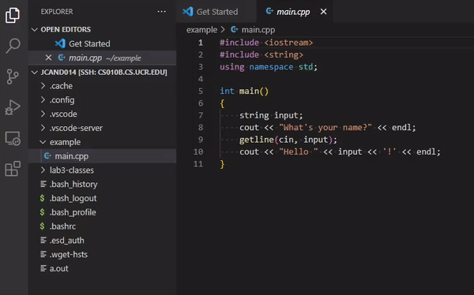

To go back to the previous section, where we go over how to setup VSCode with SSH, click [here](../installation-and-setup/).

Alternatively, if you want to set up key-based login so you don't have to enter your password every time you want to SSH, click [here](../key-based-login/).

# Part 2: Working on a Remote Server

> Note: In order to make your life easier, turn on Auto Save by going to File > Auto Save, and toggle the setting on. A very common error is forgetting to save but compiling, and you get errors such as "undefined reference to `main()`" due to the file not being saved.

Open a folder using Ctrl+O / Cmd+O, or by pressing the first icon on the tab on the left (called the explorer). When opening a folder for the first time, you will be asked if you trust the authors. Click "yes". This should default to your home directory/folder, which should have the path `/home/csmajs/[your_ucr_netid]` for students in CS related majors or `/class/classes/[your_ucr_netid]` for students who are taking this course as a service course for their major.  (you may be asked for your password again). This will be the directory that all your files will be in; think of it as your reserved space on the UCR server.

In order to demonstrate how to use VSCode with C++ so you can do your labs, we will write and compile a simple program. Create a new directory/folder called `example` by pressing the new folder button, and create a new file called `main.cpp` in the `example` directory.

<p align="center">
    
</p>

In `main.cpp`, copy and paste the following code:

```cpp
#include <iostream>
#include <string>
using namespace std;

int main()
{
    string input;
    cout << "What's your name?" << endl;
    getline(cin, input);
    cout << "Hello " << input << '!' << endl;
}
```

Now that you have your source code, lets compile it! In the list of files and folders, right click the `example` folder and click `Open in Integrated Terminal`. This will open a terminal that is looking in all the files in the `example` folder. Put in the following command:

``` g++ main.cpp ```

<p align="center">
    
</p>

Let's break down what this command is: `g++` is the compiler that we use for C++ source code. `main.cpp` is simply the path/name of the target source code file we want to compile.

> Note: The shell that we are using is called Bash. A useful feature of a lot of shells is that they support autocomplete. For example, you can type ```g++ m``` and press the Tab key, and it will autocomplete the name to ```main.cpp```. This will be useful for when you have longer file names.

Now, if your program has no errors and compiles, there should be no input in your console, and just be awaiting your next input. If your program wasn't able to compile, you would see all your error messages here. You should see that there's a new file in your directory called `a.out`. This is your executable! In order to run it, type and run this following command.

``` ./a.out ```

The `./` followed by the name of the exectuable is the way we run our compiled programs.

The terminal should now be running your executable, and waiting for your input.

By default, source files compiled by g++ are named ```a```, but usually we want to give our programs recognizable names. To do this, we can use the compiler flag ```-o```, which is a compiler flag that names the output executable. First, delete the `a.out` file. Then, run the following command:

``` g++ -o hello_world main.cpp ```

This will compile ```main.cpp``` into an executable called ```hello_world```, and you can run it by running the command ```./hello_world``` in your console.

A pro tip: It is a good idea to keep an organized workspace on your server by organizing each of your labs into their own folder. If you want to learn more about how the file system works, click [here](../linux-file-system-and-submission/) to learn about the Linux file system.