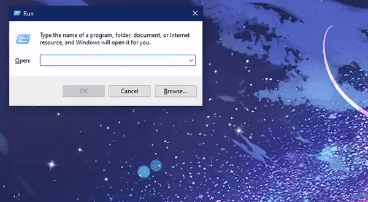
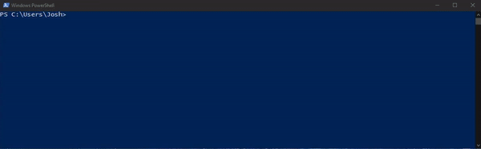

To go back to the previous section, where we go over how to setup VSCode with SSH, click [here](../installation-and-setup/).

# Optional (but recommended!): Key-Based Automatic Login

Notice that when you want to open a folder, you are prompted to enter your password again. This essentially makes it so you have to input your password twice to log in, which gets very tedious. In this section, you can set up Remote-SSH to remember your password so you only have to input it once.

Instructions vary based on operating system:

<details>
<summary><b>Windows 10/11</b></summary>

In order to set up key based login with SSH, we will first have to install an SSH client.

> NOTE: Steps 1-3 are for users who are on Windows 10. If you are on Windows 11, you can skip steps 1-3 and start from step 4.

1. Go to the Start Menu and search for "Add an Optional Feature"
2. Click "Add a feature"
3. Search for OpenSSH Server and install

<p align="center">
    
</p>

Now, we will generate something called a public/private key pair, which we will use to log into the class server.

4. Open a PowerShell terminal by pressing (Windows Key + R) which opens the "Run" application, and then type in `powershell` which opens a PowerShell terminal.
5. Run the following command:

``` ssh-keygen ```

The output should be the following:
```
Generating public/private rsa key pair.
Enter file in which to save the key [your path here]:
```

The name of the file can be whatever you want it to be, and you can simply press `Enter` if you wish to use the default path.

Now, you will be prompted with this:

```
Enter passphrase (empty for no passphrase):
```

**If you want to log in automatically without entering a password, then do not enter a passphrase**. This will require you to enter your passphrase every time you want to log in, which defeats the purpose of automatically logging in with your public/private key pair. Note that there is a tradeoff between security and convenience with this method, as anyone with access with your device will be able to log into UCR servers. Press Enter twice to proceed without entering a passphrase.

<p align="center">
    
</p>

6. Run the following two commands, substituting `{COURSE ADDRESS HERE}` with the name of the server you want to connect to. For example, if I wanted to connect to the CS010B server, I would use `jcand014@cs010b.cs.ucr.edu`.
 
```
ssh {COURSE ADDRESS HERE} mkdir .ssh
ssh {COURSE ADDRESS HERE} chmod 0700 .ssh
```

Note that you may get an error message if the directory `.ssh` already exists. You can safely ignore this error message if you get it, and it looks like this:

```
mkdir: cannot create directory '.ssh': File exists
```
    
7. Run the following command, substituting `{COURSE ADDRESS HERE}` with the name of the server you want to connect to. For example, if I wanted to connect to the CS010B server, I would use `jcand014@cs010b.cs.ucr.edu`

```
type "$env:USERPROFILE\.ssh\id_rsa.pub" | ssh {COURSE ADDRESS HERE} "cat >> .ssh/authorized_keys" 
```

You will be prompted to log into the server with your password. After this, you will be able to log onto this class server without needing to enter your password.

<p align="center">
    
</p>

</details>

<details>
<summary><b>MacOS/Linux (Debian-based)</b></summary>
We will generate something called a public/private key pair, which we will use to log into Remote-SSH.

1. Open a *local* terminal on your Mac by pressing `Cmd + Space` and typing in "Terminal", or if on Linux, open a terminal with `Ctrl + Alt + T` and run the following command:

```
ssh-keygen
```

The output should be the following:
```
Generating public/private rsa key pair.
Enter file in which to save the key [your path here]:
```
For this tutorial, we will keep this field empty, so press `Enter`, and the generated key will be saved in the default location. If you wish to save your key in a non-default location, you may do that.

Now, you will be prompted with this:

```
Enter passphrase (empty for no passphrase):
```

**Do not enter a passphrase**. This will require you to enter your passphrase every time you want to log in, which defeats the purpose of automatically logging in with your public/private key pair. Press Enter twice to proceed without entering a passphrase. Note that there is a tradeoff between security and convenience with this method, as anyone with access with your device will be able to log into UCR servers.

2. Run the following command, substituting `[YOUR NET ID HERE]` with your UCR NetID, and `[YOUR CLASS SERVER]` with the class server you wish to use:

```
ssh-copy-id [YOUR NET ID HERE]@[YOUR CLASS SERVER].cs.ucr.edu
```

For example, if my NetID is jcand014, and I wish to connect to the CS010B server, then I would run:

```
ssh-copy-id jcand014@cs010b.cs.ucr.edu
```

You will be prompted to log in after running this command.

> Note: If you wish to save your key to a different, non-default path, you can specify it in this command by using `ssh-copy-id -i your/key/path/here [YOUR NET ID HERE]@[YOUR CLASS SERVER].cs.ucr.edu` instead.

Now, the next time you SSH into your class server, you will not be prompted for a password.

</details>

